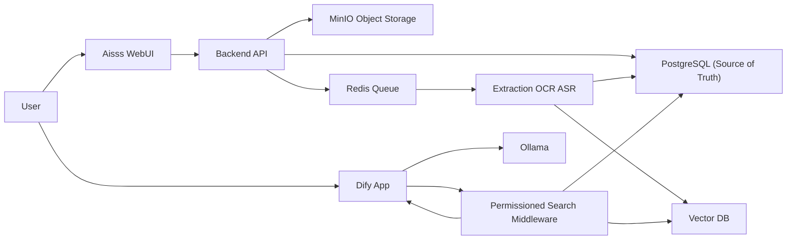

<div align="center">

# Aisss

### Case Management & Permissioned RAG Platform

*情報資料を「ケース」単位で蓄積し、権限を守ったまま AI で横断検索・要約する基盤*

<br/>

[](./docs/11-milestones.md)
[](./docs/00-index.md)
[](./docs/decisions)
[](#-license)

<br/>

[](./docs/13-deployment-docker.md)
[](https://dify.ai)
[](https://ollama.com)
[](./docs/05-data-model.md)
[](./docs/06-rag-permission-design.md)
[](./docs/07-ingestion-design.md)
[](./docs/02-overall-design.md)

</div>

---

## Overview

**Aisss** は、約 1,000 名規模の組織で「ケース(情報資料)」を登録・添付・公開範囲制御しながら蓄積し、登録されたコンテンツ(Office / PDF / 画像 / 音声)を Dify + Ollama の RAG で横断検索・要約・QA するためのプラットフォームです。

設計の中心思想はただ一つ — **ケース管理データベースを唯一の正(source of truth)とし、Dify・ベクトル検索・生成 AI はその権限判定に従う二次系として扱う** ことです。これにより「AI に質問しただけで非公開資料が漏れる」という RAG 最大の事故を、生成より手前の検索段階で遮断します。

> 詳細な背景・判断根拠は [ADR-001](./docs/decisions/ADR-001-primary-architecture.md) / [ADR-002](./docs/decisions/ADR-002-rag-permission-middleware.md) を参照してください。

---

## Highlights

| | 特徴 | 説明 |
|---|---|---|
| 🗂️ | **構造化ケース管理** | 資料区分・分類・地域・信頼性・ランク等を正規化マスタで管理し、表記ゆれを防止。 |
| 🔐 | **権限を守る RAG** | 検索ミドルウェアがユーザー権限を判定してから Dify に安全なコンテキストのみ供給。 |
| 🧩 | **マルチモーダル取り込み** | Office / PDF / 画像 OCR / 音声 ASR を非同期でテキスト化し、ケース UUID に紐づけ。 |
| 📊 | **Excel 一括取り込み** | プレビュー → 検証 → 確定登録。エラー行のみ差し戻し可能。 |
| 🧾 | **取扱条件の強制** | 照会禁止・複製禁止・印刷禁止などを検索/生成/出力の各段で多層的に制御。 |
| 🛰️ | **監査ログ** | 登録・閲覧・ダウンロード・AI 質問・エクスポートを追跡。 |

---

## Architecture



Aisss と Dify は **2 つの独立した Docker スタック** として動き、共有ネットワークで連携します。各スタックは個別に起動・停止・アップグレードでき、データベースも分離します。詳細は [Deployment: Docker Topology](./docs/13-deployment-docker.md) を参照してください。

---

## Tech Stack

| レイヤ | 採用候補 | 役割 |
|---|---|---|
| Frontend | TypeScript / React | ケース登録・検索・AI 検索 UI |
| Backend API | FastAPI または Fastify | 検証・永続化・権限判定・監査 |
| Database | PostgreSQL | メタデータ・権限・抽出テキストの正 |
| Object Storage | MinIO | 原本ファイル |
| Queue / Worker | Redis + 非同期ワーカー | OCR / ASR / 解析 / 埋め込み |
| Vector DB | Qdrant(または pgvector) | 類似検索(メタデータフィルタ) |
| AI Workflow | Dify | ワークフロー・チャット・オーケストレーション |
| LLM Runtime | Ollama | ローカル推論 |

> 最終的なスタックは「ローカル運用・監査性・保守性」を優先して確定します。

---

## Documentation

体系化された設計資料を [`docs/`](./docs/00-index.md) に格納しています。実装はここを基準に進めます。

| # | ドキュメント | 内容 |
|---|---|---|
| 00 | [Index](./docs/00-index.md) | 全体目次と読み順 |
| 01 | [Requirements](./docs/01-requirements.md) | 要件・ケース項目・成功条件 |
| 02 | [Overall Design](./docs/02-overall-design.md) | 全体設計・責務分担 |
| 03 | [Sequence Diagrams](./docs/03-sequence-diagrams.md) | 登録・抽出・同期・AI 質問のシーケンス |
| 04 | [Data Flow](./docs/04-data-flow.md) | データフロー図 |
| 05 | [Data Model](./docs/05-data-model.md) | テーブル・マスタ・RAG メタデータ |
| 06 | [RAG Permission Design](./docs/06-rag-permission-design.md) | 権限制御・条件別 AI 利用ルール |
| 07 | [Ingestion Design](./docs/07-ingestion-design.md) | Excel / OCR / ASR / 解析 |
| 08 | [WebUI Design](./docs/08-webui-design.md) | 画面設計 |
| 09 | [API Design](./docs/09-api-design.md) | API 境界・主要エンドポイント |
| 10 | [File Structure](./docs/10-file-structure.md) | 推奨ディレクトリ構成 |
| 11 | [Milestones](./docs/11-milestones.md) | MVP → 本番までの段階 |
| 12 | [Foundation Materials](./docs/12-foundation-materials.md) | 開発前に揃える基礎資料 |
| 13 | [Deployment: Docker](./docs/13-deployment-docker.md) | 2 スタック構成・起動手順 |
| — | [Development Diary](./docs/dev-diary.md) | 開発日記 |

---

## Quick Start

> 現在は **設計フェーズ** です。アプリ実装(`apps/`)は Milestone 1 以降に着手します。インフラ系サービスは雛形のまま起動確認できます。

### 前提

- Docker Desktop
- `make`(任意。Docker Desktop の GUI ボタン操作でも可)

### 初回セットアップ(1 回のみ CLI)

```bash
# 1) 共有ネットワークを作成(これを忘れると external network エラーになります)
make net          # = docker network create aisss-shared

# 2) Aisss スタックの環境変数を用意
cp aisss/.env.example aisss/.env   # 値は必ず変更すること
```

### 起動

```bash
make up           # Dify スタック → Aisss スタックの順に起動
make up-aisss     # Aisss スタックのみ
make up-dify      # Dify スタックのみ
make down         # 両スタック停止
```

初回セットアップ後は、日常運用を **Docker Desktop のボタン操作**(スタック単位の Start / Stop / Restart)だけで完結できます。

---

## Repository Layout

```text
Aisss/
├─ docs/                     # 設計資料(実装の基準)
│  └─ decisions/             # ADR
├─ aisss/                    # Aisss アプリスタック(Compose)
│  ├─ docker-compose.yaml
│  └─ .env.example
├─ dify/                     # Dify 連携用オーバーライド
│  └─ docker-compose.override.yaml
├─ apps/                     # web / api / workers(Milestone 1 で実装)
├─ Makefile                  # 2 スタック一括操作
└─ README.md
```

---

## Security & Access Control

Aisss はインテリジェンス資料を扱う前提で、**権限を生成より手前で守る** ことを最優先に設計しています。

- 公開範囲外・`照会禁止` の資料は、ベクトル検索の段階で **完全除外**(存在も示さない)。
- `複製禁止` は逐語転記を抑制し、要約・分析のみ許可。
- `印刷禁止` は回答の印刷・エクスポートを抑止。
- 複数条件が重なる場合は **最も制限の強い条件を優先**(最小権限の原則)。

詳細は [RAG Permission Design](./docs/06-rag-permission-design.md) を参照してください。

---

## Roadmap

| フェーズ | 目標 |
|---|---|
| M0 | 設計ベースライン(完了) |
| M1 | リポジトリ・開発環境の骨格 |
| M2 | ケース管理 MVP |
| M3 | 添付・テキスト抽出 MVP |
| M4 | Excel 一括取り込み |
| M5 | 権限付き RAG MVP |
| M6 | 運用ハードニング |
| M7 | 本番パイロット |

→ [Milestones](./docs/11-milestones.md)

---

## License

ライセンスは未定(TBD)です。組織の方針確定後に設定します。

---

<div align="center">
<sub>Built as a maintainable, audit-first case management & RAG platform.</sub>
</div>
