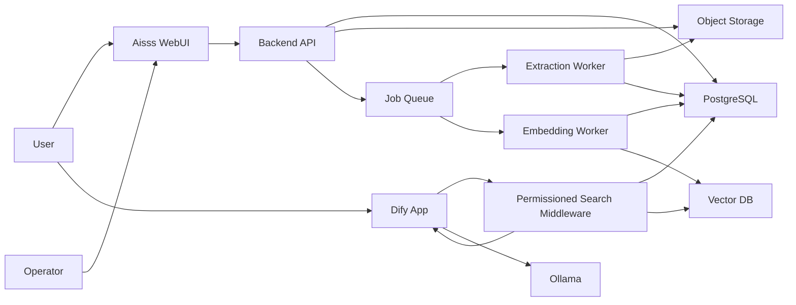

# Overall Design

## Architecture Summary

Aisss consists of a case management WebUI, backend API, PostgreSQL database, object storage, asynchronous ingestion workers, vector database, permissioned search middleware, Dify workflows, and Ollama.

The system separates three responsibilities:

- Record management: Aisss WebUI, backend API, PostgreSQL, and object storage.
- Knowledge indexing: extraction workers, embedding jobs, and vector database.
- AI interaction: Dify workflows and Ollama, fed only by permission-filtered search results.

## Component Diagram

## Source of Truth

PostgreSQL is the source of truth for:

- Cases.
- Metadata.
- Master lists.
- Viewing ranges.
- Handling conditions.
- Users and groups.
- Attachment metadata.
- Extracted text state.
- RAG synchronization state.
- Audit logs.

Object storage is the source of truth for original files. The vector database and Dify knowledge state are rebuildable secondary indexes.

## Primary Components

| Component | Responsibility | Notes |
|---|---|---|
| Aisss WebUI | Case registration, search, master management, import preview, permission management | Do not expose storage URLs directly. |
| Backend API | Validation, persistence, permission checks, audit logs, job dispatch | All WebUI operations go through this API. |
| PostgreSQL | Relational metadata, access control, audit, extracted text | Use UUID primary keys. |
| Object Storage | Original attachments and derived artifacts | MinIO is recommended for self-hosted S3-compatible storage. |
| Job Queue | Reliable async processing | Required for OCR, ASR, parsing, embeddings, and resync. |
| Extraction Worker | Office/PDF parsing, OCR, ASR orchestration | Stores extracted text and extraction status. |
| Embedding Worker | Chunking and vector registration | Uses metadata from PostgreSQL. |
| Vector DB | Similarity search with metadata filters | Qdrant, Milvus, or pgvector are candidates. |
| Permissioned Search Middleware | Enforces user permissions before Dify receives context | Most important security boundary for RAG. |
| Dify | Chat/workflow orchestration | Should not be the permission authority. |
| Ollama | Local LLM inference | Model choice can evolve independently. |

## Recommended Technology Stack

Initial recommendation:

- Frontend: TypeScript, React, Vite or Next.js.
- Backend: Python FastAPI or TypeScript Fastify.
- Database: PostgreSQL.
- Object storage: MinIO.
- Queue: Redis Queue, Celery, BullMQ, or equivalent.
- Vector database: Qdrant for explicit metadata filtering, or pgvector for simpler deployment.
- AI workflow: Dify.
- LLM runtime: Ollama.
- OCR: Tesseract or PaddleOCR depending on Japanese accuracy requirements.
- ASR: Whisper-compatible local engine.

The final stack should favor local operation, auditability, and maintainability over novelty.

## Key Design Decisions

### Keep Aisss as the Permission Authority

All user, group, viewing range, and handling condition decisions are evaluated by Aisss. Dify receives retrieved context only after the middleware has applied those rules.

### Treat Dify Direct Uploads as Supplemental Knowledge

Dify may contain Office/PDF/text documents uploaded directly by operators. These documents must not become a permission bypass. Aisss should register a metadata shadow record for any Dify-direct source that is used in production RAG, including viewing range and handling conditions.

### Rebuildable RAG Index

The vector index can be deleted and rebuilt from PostgreSQL and object storage. Do not store unique business state only in the vector database or Dify.

### Asynchronous Ingestion

Case registration returns after metadata and files are saved. Extraction, chunking, embedding, and Dify synchronization run in the background with visible job status.

## Security Boundaries

- Storage download endpoint checks case permission before streaming files.
- Search middleware checks user permissions before vector search and again before returning citations.
- Dify does not receive hidden or denied chunks.
- Handling-condition output restrictions are applied before answer generation and before export.
- Admin APIs require explicit operator roles and audit logs.

## Failure Handling

- If extraction fails, the case remains registered with a visible extraction error status.
- If embedding fails, the case remains searchable by metadata but not by semantic search until retry succeeds.
- If Dify is unavailable, WebUI record management continues.
- If vector DB is unavailable, AI search is degraded but case data remains intact.
