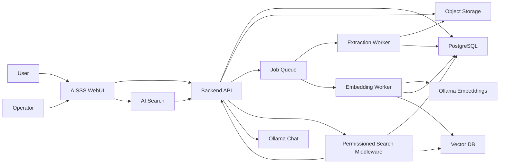

# Overall Design

## Architecture Summary

AISSS consists of a case management WebUI, backend API, PostgreSQL database, object storage, asynchronous ingestion workers, vector database, permissioned search middleware, and host Ollama for embeddings and chat.

The system separates three responsibilities:

- Record management: AISSS WebUI, backend API, PostgreSQL, and object storage.
- Knowledge indexing: extraction workers, embedding jobs (Ollama embeddings), and vector database.
- AI interaction: AISSS `/api/ai/chat`, fed only by permission-filtered search results, then Ollama completion.

## Component Diagram

## Source of Truth

PostgreSQL is the source of truth for:

- Cases.
- Metadata.
- Master lists.
- Viewing ranges.
- Handling conditions.
- Users and groups.
- Attachment metadata.
- Extracted text state.
- RAG synchronization state.
- Model role configuration.
- Audit logs.

Object storage is the source of truth for original files. The vector database is a rebuildable secondary index.

## Primary Components

| Component | Responsibility | Notes |
|---|---|---|
| AISSS WebUI | Case registration, search, AI search, RAG admin, model admin | Do not expose storage URLs or Ollama directly. |
| Backend API | Validation, persistence, permission checks, audit logs, job dispatch, Ollama proxy, AI chat | All WebUI operations go through this API. |
| PostgreSQL | Relational metadata, access control, audit, extracted text | Use UUID primary keys. |
| Object Storage | Original attachments and derived artifacts | MinIO is recommended for self-hosted S3-compatible storage. |
| Job Queue | Reliable async processing | Required for OCR, ASR, parsing, embeddings, and resync. |
| Extraction Worker | Office/PDF parsing, OCR, ASR orchestration | Stores extracted text and extraction status. |
| Embedding Worker | Chunking and vector registration via Ollama | Uses metadata from PostgreSQL. |
| Vector DB | Similarity search with metadata filters | Qdrant recommended; see deployment docs. |
| Permissioned Search Middleware | Enforces user permissions before LLM receives context | Most important security boundary for RAG. |
| Ollama (host) | Embeddings, chat, optional rerank | Reachable via `OLLAMA_BASE_URL`. |

## Recommended Technology Stack

Initial recommendation:

- Frontend: TypeScript, React, Vite or Next.js.
- Backend: Python FastAPI or TypeScript Fastify.
- Database: PostgreSQL.
- Object storage: MinIO.
- Queue: Redis Queue, Celery, BullMQ, or equivalent.
- Vector database: Qdrant for explicit metadata filtering, or pgvector for simpler deployment.
- LLM runtime: Ollama on host.
- OCR: Tesseract or PaddleOCR depending on Japanese accuracy requirements.
- ASR: Whisper-compatible local engine.

The final stack should favor local operation, auditability, and maintainability over novelty.

## Key Design Decisions

### Keep AISSS as the Permission Authority

All user, group, viewing range, and handling condition decisions are evaluated by AISSS. Ollama receives retrieved context only after the middleware has applied those rules.

### Single Knowledge Path

All RAG content originates from AISSS cases and attachments. Operators monitor ingestion through RAG management; there is no external knowledge-base upload path.

### Rebuildable RAG Index

The vector index can be deleted and rebuilt from PostgreSQL and object storage. Do not store unique business state only in the vector database.

### Asynchronous Ingestion

Case registration returns after metadata and files are saved. Extraction, chunking, and embedding run in the background with visible job status in RAG management.

## Security Boundaries

- Storage download endpoint checks case permission before streaming files.
- Search middleware checks user permissions before vector search and again before returning citations.
- The LLM does not receive hidden or denied chunks.
- Handling-condition output restrictions are applied before answer generation and before export.
- Admin APIs require explicit operator roles and audit logs.
- WebUI never calls Ollama directly.

## Failure Handling

- If extraction fails, the case remains registered with a visible extraction error status.
- If embedding fails, the case remains searchable by metadata but not by semantic search until retry succeeds.
- If Ollama is unavailable, AI search is disabled but case management continues; WebUI shows health status.
- If vector DB is unavailable, AI search is degraded but case data remains intact.

## Related

- [ADR-004: Native Ollama AI](./decisions/ADR-004-native-ollama-ai.md)
- [Ollama Integration Guide](./15-ollama-integration.md)
- [RAG Admin Guide](./16-rag-admin-guide.md)
