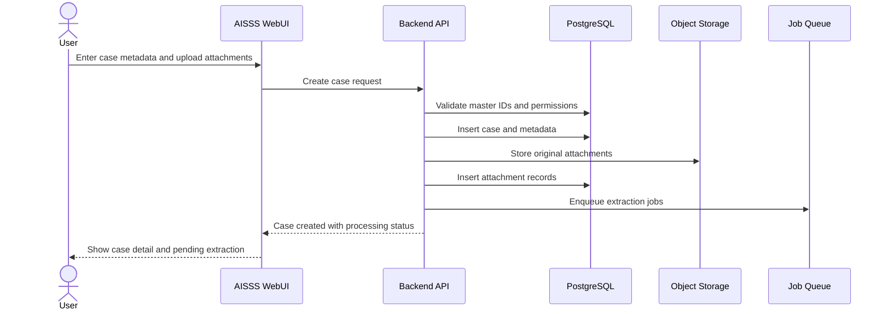
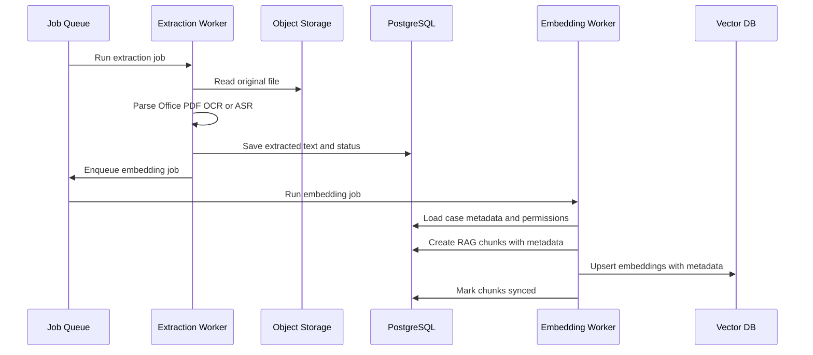
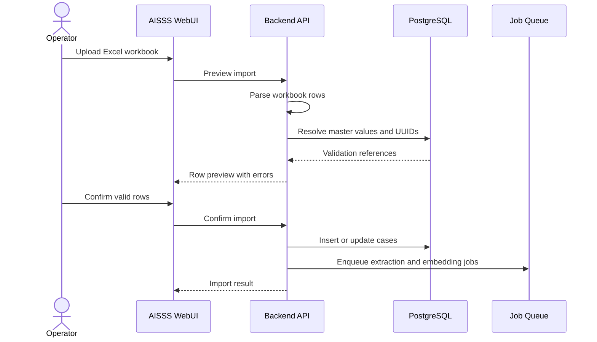
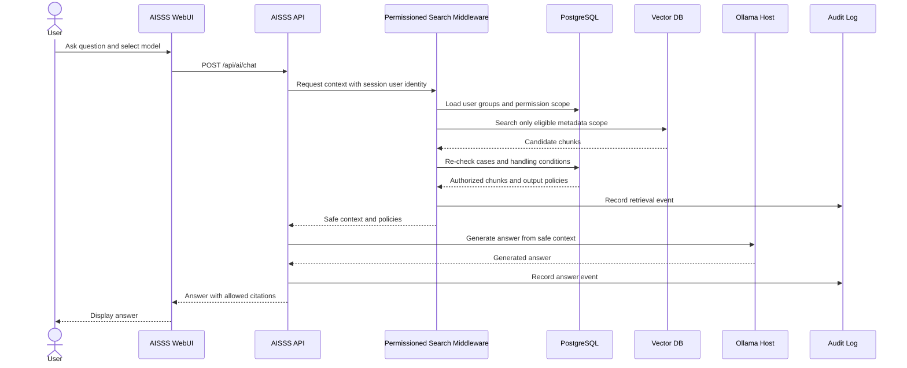
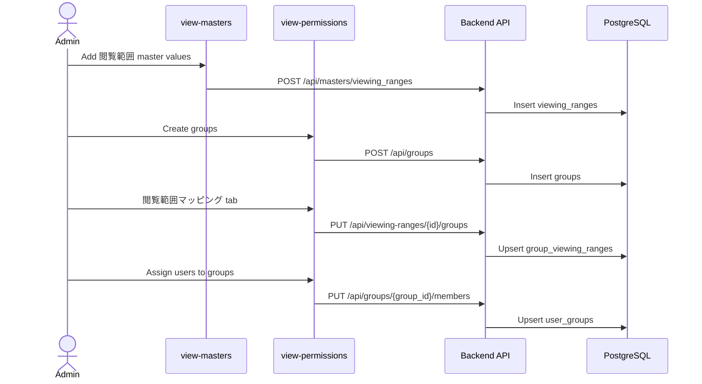
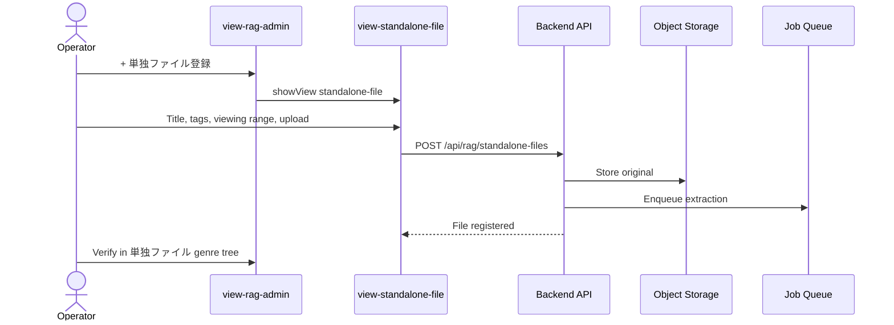
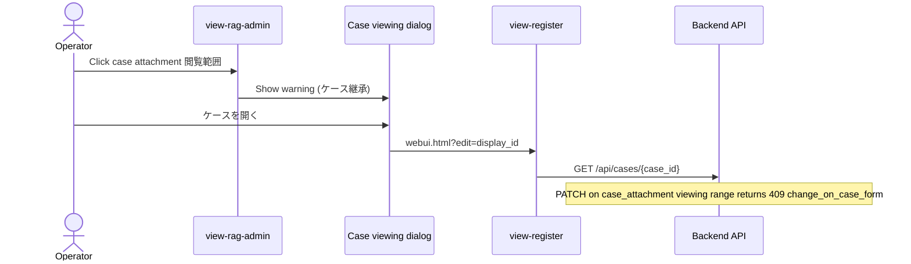
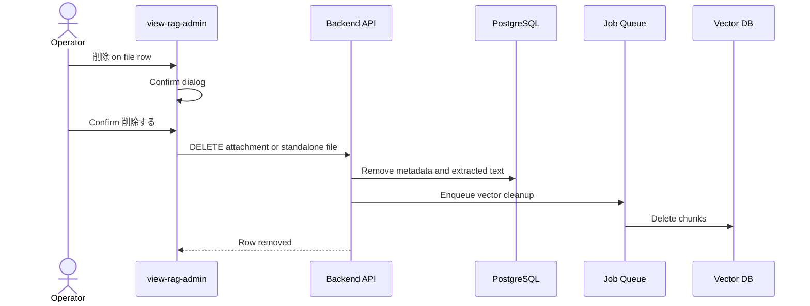
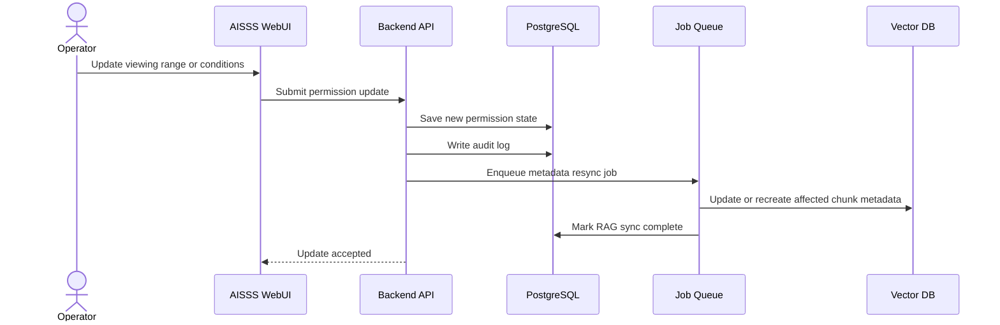
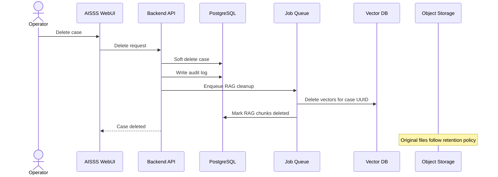

# Sequence Diagrams

> Screen IDs and mock coverage: [WebUI Mock Inventory and Flows](./18-webui-mock-inventory-and-flows.md).

## Case Registration with Attachments



**Mock:** `view-register` (登録 → ケース（事象）). Excel import button uses a simplified autofill in the mock; full preview flow is in [Excel Import](#excel-import).

→ Details: [18 § Flow B](./18-webui-mock-inventory-and-flows.md#flow-b-case-lifecycle-register--search--detail--edit--rag)

## Case Search, Detail, and Edit

```mermaid
sequenceDiagram
  actor User
  participant Search as view-search
  participant Detail as case-detail.html
  participant Edit as view-register
  participant API as Backend API
  participant DB as PostgreSQL

  User->>Search: Filter and open case link
  Search->>Detail: Navigate ?case=display_id
  Detail->>API: GET /api/cases/{case_id}
  API->>DB: Permission check and load
  DB-->>API: Case body sections and metadata
  API-->>Detail: Authorized case detail
  User->>Detail: Click 編集
  Detail->>Edit: webui.html?edit=display_id
  Edit->>API: GET /api/cases/{case_id}
  API-->>Edit: Prefill form
  User->>Edit: Submit 更新する
  Edit->>API: PATCH /api/cases/{case_id}
  API->>DB: Update case and viewing ranges
  API-->>Edit: Update accepted
  Edit-->>User: Toast; optional return to detail
```

**Mock:** Search table links to `case-detail.html`; **編集** and RAG **ケースを開く** use `?edit=` with `CASE_EDIT_RECORDS`.

→ Details: [18 § Flow B](./18-webui-mock-inventory-and-flows.md#flow-b-case-lifecycle-register--search--detail--edit--rag), [08 § Case detail and edit](./08-webui-design.md)

## Text Extraction and RAG Indexing



**Mock:** Pipeline status labels appear in `view-search` (状態 column) and `view-rag-admin` (パイプライン column).

## Excel Import



**Mock:** `view-register` Excel button only simulates row parse into the form (no preview/confirm UI yet).

→ Backlog: [18 § Mock vs Specification Gaps](./18-webui-mock-inventory-and-flows.md#mock-vs-specification-gaps-backlog)

## AI Question Answering



**Mock:** `view-ai` shows a static sample answer and citation for `CASE-2026-00142`.

## Permission Bootstrap (Administrator Setup)



→ Details: [18 § Flow A](./18-webui-mock-inventory-and-flows.md#flow-a-permission-bootstrap-administrator), [17](./17-viewing-range-permission-flow.md)

## Standalone File Registration



→ Details: [18 § Flow C](./18-webui-mock-inventory-and-flows.md#flow-c-standalone-file--rag--ai-citation), [16](./16-rag-admin-guide.md)

## RAG Viewing Range Guard → Case Edit



→ Details: [17](./17-viewing-range-permission-flow.md), [09 § RAG Admin](./09-api-design.md#rag-administration-apis)

## RAG File Delete



**Mock:** Delete dialog warns that registration, extracted text, and vectors are permanently removed.

→ Details: [16 § File list](./16-rag-admin-guide.md), [18](./18-webui-mock-inventory-and-flows.md)

## Viewing Range or Condition Change



**Mock:** Case edit (`view-register` **更新する**); standalone range edit in `view-rag-admin` select + **変更を保存**.

→ Details: [18 § Flow B/C](./18-webui-mock-inventory-and-flows.md#operator-flows)

## Case Deletion



