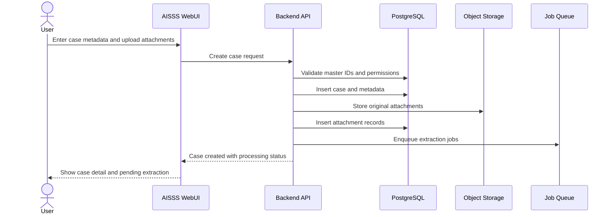
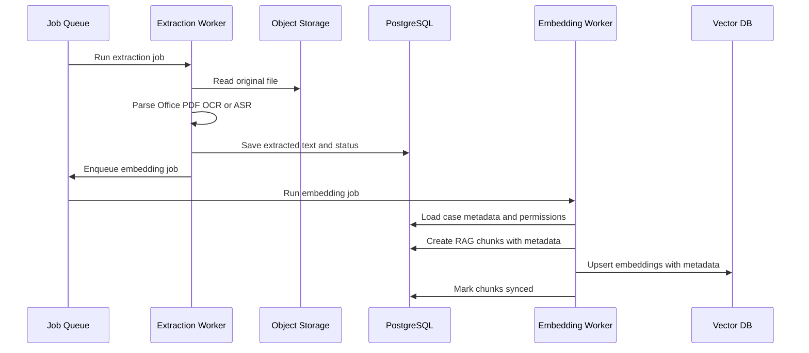
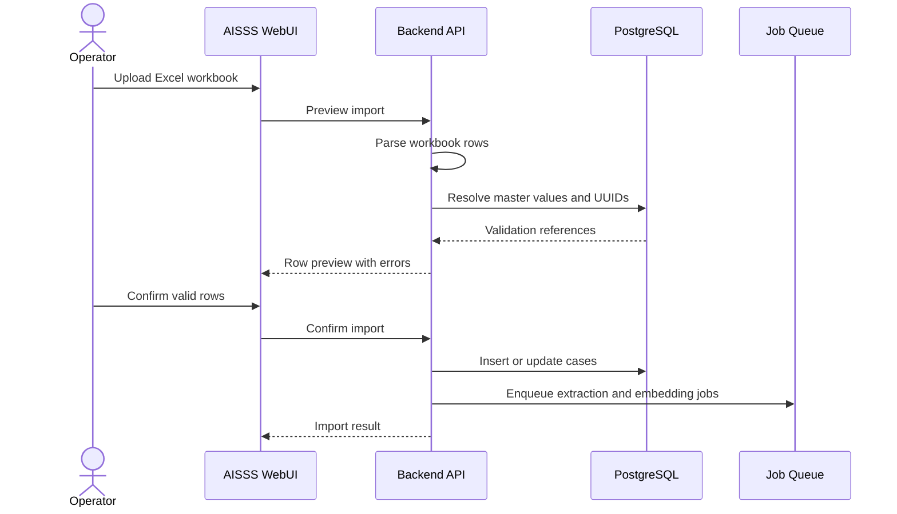
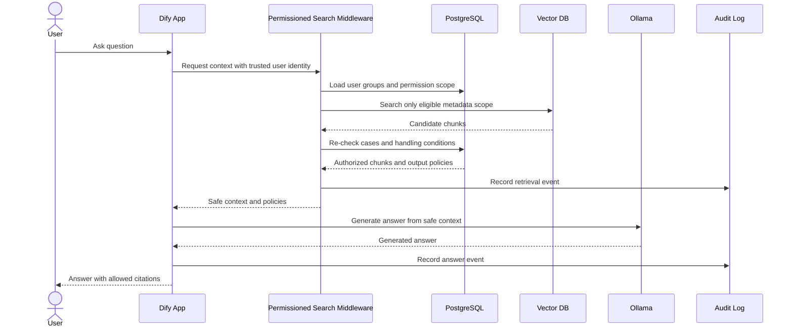
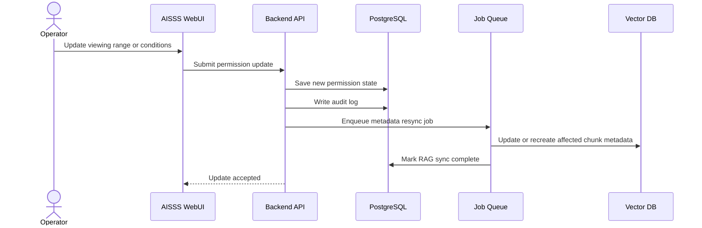
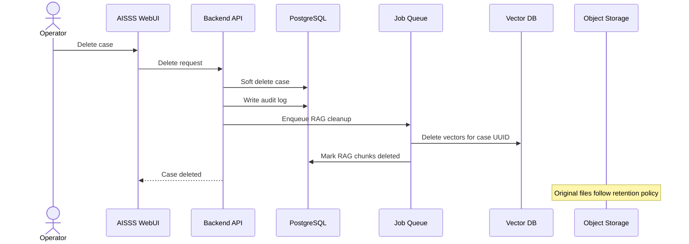
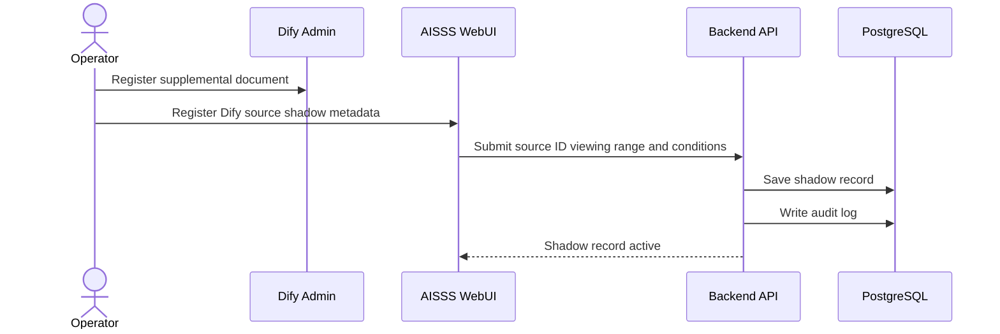

# Sequence Diagrams

## Case Registration with Attachments

## Text Extraction and RAG Indexing

## Excel Import

## AI Question Answering

## Viewing Range or Condition Change

## Case Deletion

## Dify Direct Document Registration

