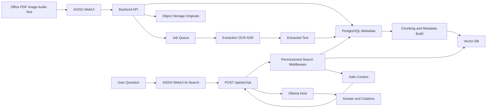
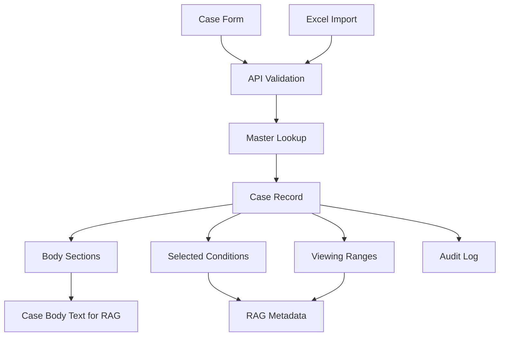
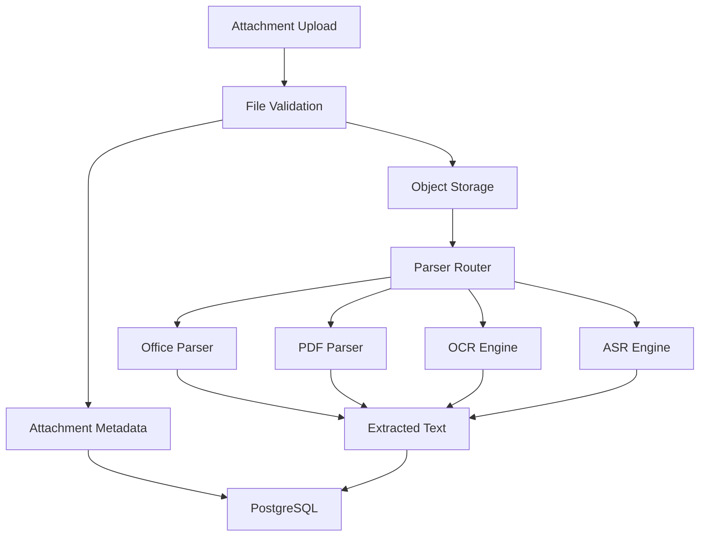
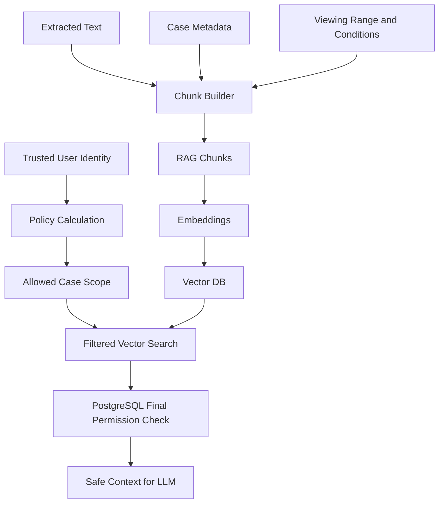

# Data Flow

> Mock screen IDs and operator flows: [WebUI Mock Inventory and Flows](./18-webui-mock-inventory-and-flows.md).

## WebUI Screen Map

| Mock view / file | Primary stores | Job queue | Primary APIs |
|---|---|---|---|
| `view-search` | PostgreSQL (case metadata, FTS) | — | `GET /api/cases` |
| `view-register` | PostgreSQL, MinIO (attachments) | Extraction, embedding | `POST` / `PATCH /api/cases`, `POST .../attachments` |
| `case-detail.html` | PostgreSQL, MinIO | — | `GET /api/cases/{id}`, attachment download |
| `view-ai` | PostgreSQL, Qdrant (via middleware) | — | `POST /api/ai/chat`, `GET /api/ollama/health` |
| `view-standalone-file` | PostgreSQL, MinIO | Extraction, embedding | `POST /api/rag/standalone-files` |
| `view-rag-admin` | PostgreSQL, Qdrant | Reindex, metadata resync | `GET /api/rag/*`, `PATCH` enable / viewing-ranges |
| `view-models` | PostgreSQL (model roles) | — | `GET /api/ollama/models`, `PUT /api/admin/ollama/model-roles` |
| `view-permissions` | PostgreSQL (users, groups, mappings) | Permission cache invalidation | `GET/PUT /api/users`, `/api/groups`, viewing-range groups |
| `view-masters` | PostgreSQL (master tables) | Optional RAG label refresh | `GET/POST/PATCH /api/masters/{name}` |
| 監査ログ (planned) | PostgreSQL (audit) | — | `GET /api/audit-logs` |
| ジョブ状態 (planned) | PostgreSQL, Queue | Retry | `GET /api/jobs`, `POST .../retry` |

## High-Level Flow

**Screens:** Registration and attachments → `view-register`; search → `view-search`; AI → `view-ai`; RAG ops → `view-rag-admin`.

## Record Data

**Screens:** `view-register` (create/update), Excel import on same form; master lookup also via `view-masters`.

## Attachment Data

**Screens:** Upload on `view-register` or `view-standalone-file`; status on `case-detail.html`, `view-search`, `view-rag-admin`.

## Permissioned RAG Data

**Screens:** Chunk visibility governed by `view-permissions` setup; AI consumption via `view-ai`; index toggles on `view-rag-admin`.

## Data Classification

| Data | Primary Store | Secondary Store | Notes |
|---|---|---|---|
| Case metadata | PostgreSQL | Vector metadata | PostgreSQL is authoritative. |
| Body sections | PostgreSQL | RAG chunks | Stored separately, rendered together. |
| Original files | Object storage | None | Download through API only. |
| Extracted text | PostgreSQL | RAG chunks | Rebuildable from original files when parser is stable. |
| Embeddings | Vector DB | None | Rebuildable. |
| AI answer history | AISSS audit | Audit log summary | Avoid storing restricted text where not governed. |
| Audit log | PostgreSQL | Backup | Protected operator access. |

## Data Freshness Rules

| Change | Required data flow | Triggering WebUI (mock) |
|---|---|---|
| Case metadata update | Update PostgreSQL, rebuild affected RAG metadata. | `view-register` **更新する** |
| Body update | Recreate body extracted text and chunks. | `view-register` edit mode |
| Attachment upload | Store original, extract text, chunk, embed. | `view-register` upload zone |
| Attachment delete | Remove extracted text and vector chunks. | `view-rag-admin` **削除** (or case edit) |
| Viewing range change | Update PostgreSQL, update vector metadata, clear permission caches. | `view-register` edit; `view-rag-admin` standalone select |
| Condition change | Update PostgreSQL, update vector metadata, clear permission caches. | `view-register` condition checkboxes |
| Master label change | Update display labels and optionally refresh RAG metadata. | `view-masters` |
| Group / mapping change | Invalidate permission caches; no direct vector rewrite. | `view-permissions` |
| Case delete | Soft delete, remove vectors, retain originals according to retention policy. | Not in mock yet |
| RAG ㋹ toggle | Update chunk index inclusion in Qdrant. | `view-rag-admin` checkboxes + **変更を保存** |

All searchable content enters through AISSS cases and attachments. There is no parallel direct-upload knowledge path.

→ Sequences: [03-sequence-diagrams.md](./03-sequence-diagrams.md)
