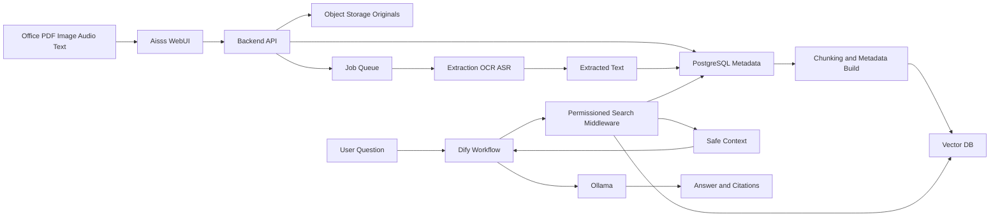
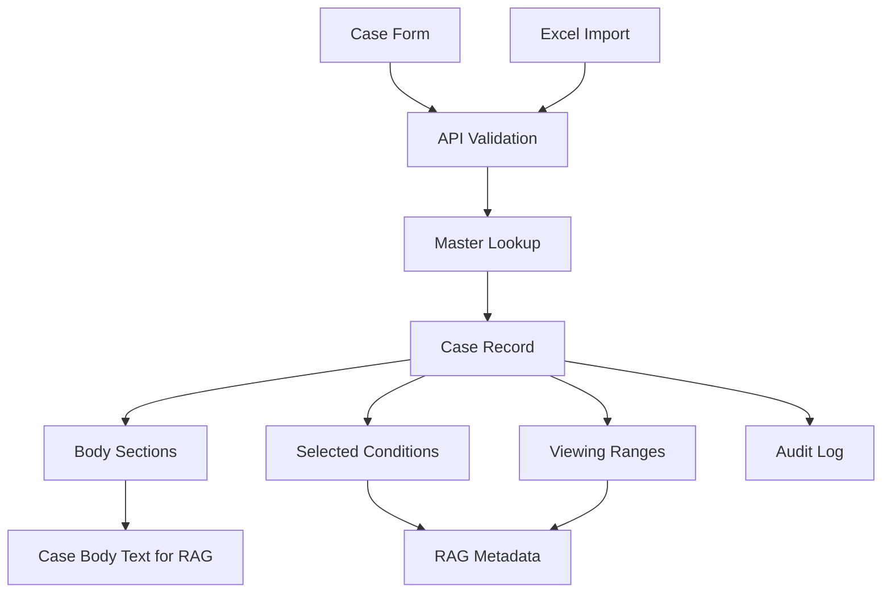
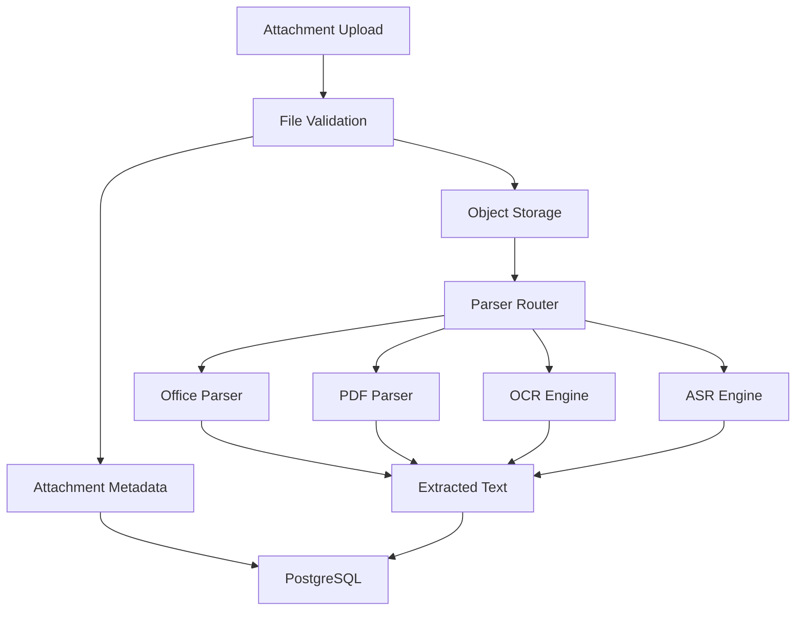
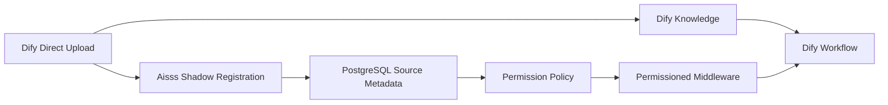

# Data Flow

## High-Level Flow

## Record Data

## Attachment Data

## Permissioned RAG Data

## Data Classification

| Data | Primary Store | Secondary Store | Notes |
|---|---|---|---|
| Case metadata | PostgreSQL | Vector metadata | PostgreSQL is authoritative. |
| Body sections | PostgreSQL | RAG chunks | Stored separately, rendered together. |
| Original files | Object storage | None | Download through API only. |
| Extracted text | PostgreSQL | RAG chunks | Rebuildable from original files when parser is stable. |
| Embeddings | Vector DB | None | Rebuildable. |
| Dify answer history | Dify or Aisss audit | Audit log summary | Avoid storing restricted text where not governed. |
| Audit log | PostgreSQL | Backup | Protected operator access. |

## Data Freshness Rules

| Change | Required Data Flow |
|---|---|
| Case metadata update | Update PostgreSQL, rebuild affected RAG metadata. |
| Body update | Recreate body extracted text and chunks. |
| Attachment upload | Store original, extract text, chunk, embed. |
| Attachment delete | Remove extracted text and vector chunks. |
| Viewing range change | Update PostgreSQL, update vector metadata, clear permission caches. |
| Condition change | Update PostgreSQL, update vector metadata, clear permission caches. |
| Master label change | Update display labels and optionally refresh RAG metadata. |
| Case delete | Soft delete, remove vectors, retain originals according to retention policy. |

## Dify Direct Data

Dify direct documents must not become part of sensitive production RAG unless Aisss has metadata that defines ownership, viewing range, and handling conditions.
