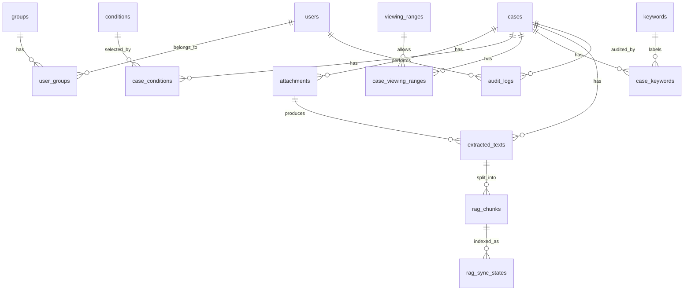

# Data Model

## Modeling Principles

- Use UUIDs as internal primary keys.
- Keep human-facing numbers such as `資料番号` and display IDs separate from UUIDs.
- Normalize editable lists into master tables.
- Represent multi-value fields with join tables.
- Store original files in object storage, not PostgreSQL.
- Store extracted text and RAG synchronization status in PostgreSQL so indexes can be rebuilt.

## Entity Relationship Overview

## Core Tables

### `cases`

| Column | Type | Notes |
|---|---|---|
| `id` | UUID | Primary key. |
| `display_id` | Text | Human-facing ID such as `CASE-2026-00001`. |
| `material_number` | Text | User-managed 資料番号. |
| `title` | Text | Required 表題. |
| `summary` | Text | 要約. |
| `body_summary` | Text | 本文 1. |
| `body_article` | Text | 本文 2. |
| `body_assessment` | Text | 本文 3. |
| `body_reference` | Text | 本文 4. |
| `event_start_date` | Date | Required when available. |
| `event_end_date` | Date, nullable | Nullable. |
| `material_type_id` | UUID | FK to master. |
| `registering_department_id` | UUID | FK to department master. |
| `category_id` | UUID | FK to category master. |
| `region_id` | UUID | FK to region master. |
| `source_id` | UUID | FK to source master. |
| `registrant_id` | UUID | FK to users or persons. |
| `information_request_id` | UUID | FK to master. |
| `handling_type_id` | UUID | FK to handling type master. |
| `reliability_id` | UUID | FK to reliability master. |
| `accuracy_id` | UUID | FK to accuracy master. |
| `rank_id` | UUID | FK to rank master. |
| `retention_policy_id` | UUID | FK to retention policy. |
| `classification_number` | Text | 分類番号. |
| `action_taken` | Text | 処置. |
| `condition_notes` | Text | 条件（その他）. |
| `viewing_range_note` | Text | 閲覧範囲（直接入力）. |
| `note_1` to `note_6` | Text | 備考1-6. |
| `created_by` | UUID | FK to users. |
| `updated_by` | UUID | FK to users. |
| `created_at` | Timestamp | Server timestamp. |
| `updated_at` | Timestamp | Server timestamp. |
| `deleted_at` | Timestamp, nullable | Soft delete for audit and RAG cleanup. |

### `attachments`

| Column | Type | Notes |
|---|---|---|
| `id` | UUID | Primary key. |
| `case_id` | UUID | FK to `cases`. |
| `file_name` | Text | Original file name. |
| `storage_key` | Text | Object storage key. |
| `content_type` | Text | MIME type. |
| `file_size` | Bigint | Bytes. |
| `sha256` | Text | Deduplication and audit. |
| `attachment_kind` | Text | `office`, `pdf`, `image`, `audio`, `text`, `other`. |
| `uploaded_by` | UUID | FK to users. |
| `uploaded_at` | Timestamp | Server timestamp. |
| `extraction_status` | Text | `pending`, `running`, `succeeded`, `failed`, `skipped`. |
| `extraction_error` | Text | Last error summary. |

### `extracted_texts`

| Column | Type | Notes |
|---|---|---|
| `id` | UUID | Primary key. |
| `case_id` | UUID | FK to `cases`. |
| `attachment_id` | UUID, nullable | Null for case body derived text. |
| `source_type` | Text | `case_body`, `office_parse`, `pdf_parse`, `ocr`, `asr`, `manual_text`. |
| `text` | Text | Extracted or joined text. |
| `language` | Text | Example: `ja`. |
| `extraction_engine` | Text | Parser/OCR/ASR engine. |
| `created_at` | Timestamp | Server timestamp. |

### `rag_chunks`

| Column | Type | Notes |
|---|---|---|
| `id` | UUID | Primary key. |
| `case_id` | UUID | FK to `cases`. |
| `attachment_id` | UUID, nullable | Preserves source. |
| `extracted_text_id` | UUID | FK to `extracted_texts`. |
| `chunk_index` | Integer | Stable order. |
| `chunk_text` | Text | Text sent for embedding. |
| `metadata_json` | JSONB | Permission and filtering metadata. |
| `created_at` | Timestamp | Server timestamp. |

### `rag_sync_states`

| Column | Type | Notes |
|---|---|---|
| `id` | UUID | Primary key. |
| `chunk_id` | UUID | FK to `rag_chunks`. |
| `vector_collection` | Text | Target collection. |
| `vector_point_id` | Text | External vector ID. |
| `sync_status` | Text | `pending`, `synced`, `failed`, `deleted`. |
| `last_synced_at` | Timestamp | Last successful sync. |
| `last_error` | Text | Error summary. |

## Master Tables

Each editable master should follow the same pattern:

| Column | Type | Notes |
|---|---|---|
| `id` | UUID | Primary key. |
| `code` | Text | Stable optional code. |
| `name` | Text | Display label. |
| `sort_order` | Integer | UI order. |
| `is_active` | Boolean | Soft disable. |
| `created_at` | Timestamp | Server timestamp. |
| `updated_at` | Timestamp | Server timestamp. |

Initial master tables:

- `material_types`
- `departments`
- `categories`
- `regions`
- `sources`
- `information_requests`
- `handling_types`
- `reliability_levels`
- `accuracy_levels`
- `rank_levels`
- `retention_policies`
- `conditions`
- `viewing_ranges`
- `keywords`
- `persons`
- `acquisition_locations`

## Join Tables

| Table | Purpose |
|---|---|
| `case_conditions` | Multi-select handling conditions. |
| `case_viewing_ranges` | Allowed viewing ranges for a case. |
| `case_keywords` | Normalized keywords from keyword1-6. |
| `case_collectors` | Multi-value 情報収集者. |
| `user_groups` | User membership in groups. |
| `group_viewing_ranges` | Groups allowed by viewing range definitions. |

## Conditions

`conditions` should include policy fields, not only labels.

| Column | Type | Notes |
|---|---|---|
| `id` | UUID | Primary key. |
| `name` | Text | Example: 印刷禁止. |
| `search_policy` | Text | `allow`, `restricted`, `deny`. |
| `quote_policy` | Text | `allow`, `summarize_only`, `deny`. |
| `export_policy` | Text | `allow`, `deny_print`, `deny_copy`, `deny_all`. |
| `priority` | Integer | Higher priority wins when conditions overlap. |
| `is_active` | Boolean | Soft disable. |

## Audit Logs

`audit_logs` records sensitive actions:

- Case create, update, delete, restore.
- Attachment upload, download, delete.
- Permission/viewing-range change.
- Master list change.
- Excel import preview and confirmed import.
- AI query, retrieved case IDs, generated answer ID.
- Export, print, copy attempt when technically detectable.

## RAG Metadata

Every chunk metadata object should include:

- `case_id`
- `display_id`
- `attachment_id`
- `source_type`
- `title`
- `material_type`
- `department`
- `category`
- `region`
- `source`
- `event_start_date`
- `event_end_date`
- `information_request`
- `handling_type`
- `reliability`
- `accuracy`
- `rank`
- `keywords`
- `viewing_range_ids`
- `condition_ids`
- `search_policy`
- `quote_policy`
- `export_policy`

The middleware derives effective policies from PostgreSQL at query time. The metadata exists for filtering and traceability, but PostgreSQL remains the authority.
