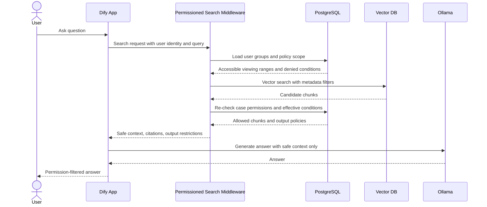

# RAG Permission Design

## Core Rule

RAG must never expand a user's access. Aisss decides what the user can view before any text reaches Dify or Ollama.

The permissioned search middleware is the enforcement point. It receives the authenticated user and query, calculates the accessible case scope from PostgreSQL, searches only eligible chunks, applies handling-condition rules, and returns safe context to Dify.

## Query Flow

## Permission Inputs

The middleware uses:

- Authenticated user ID.
- User group membership.
- Case viewing ranges.
- Direct viewing range notes only as display information, not primary ACL.
- Case handling conditions.
- Handling type sensitivity.
- Case status and deletion state.
- Attachment and chunk source type.
- Request channel, such as WebUI, Dify chat, API, export, or external sharing workflow.

## Effective Policy Calculation

For each candidate case:

1. Deny if the case is deleted or archived beyond accessible retention rules.
2. Deny if the user does not belong to any group allowed by the case viewing range.
3. Deny if a selected condition has `search_policy = deny` for the request channel.
4. Allow retrieval only for remaining chunks.
5. Apply the most restrictive quote and export policies among selected conditions and handling type.
6. Return citations only for cases still allowed after the final database check.

When policies overlap, the most restrictive policy wins.

## Condition Rules for AI Usage

These are recommended initial rules. They should be reviewed against organizational information handling regulations before production.

| Condition | Search Target | Answer Usage | Verbatim Quote | Citation | Export/Print | Implementation Rule |
|---|---|---|---|---|---|---|
| 通常 | Include | Use normally | Allow | Show | Allow | Standard behavior. |
| 公開範囲=全員 | Include for all authenticated users | Use normally | Allow | Show | Allow | Wide access still requires authentication. |
| 公開範囲=担当者のみ | Include only for allowed groups | Use for allowed groups only | Allow for allowed groups | Show to allowed groups | Follow export policy | Unauthorized users must not see existence. |
| 印刷禁止 | Include | Use normally | Allow | Show | Deny print/PDF export | WebUI and answer export must mark print disabled. |
| 複製禁止 | Include | Summarize and analyze only | Deny or strongly suppress | Show | Deny copy/export as text | Do not pass instructions that invite long verbatim reproduction. |
| 照会禁止 | Exclude by default | Do not use | Deny | Hide | Deny | Strongest default. Needs explicit exception role if changed. |
| 特定経路による情報提供禁止 | Exclude for matching channel | Do not use in that channel | Deny in that channel | Hide in that channel | Deny in that channel | Channel/API key must be part of policy input. |
| 取扱制限高 | Include only for allowed groups | Prefer summary | Restrict | Show to allowed groups | Restrict | Handling type can raise effective policy even without condition flags. |

## Search Policies

`search_policy` controls whether chunks can enter retrieval:

- `allow`: eligible after viewing range check.
- `restricted`: eligible only for roles, groups, or channels specified by policy.
- `deny`: excluded before vector search whenever possible.

Strong restrictions should be enforced before vector search by metadata filters. Final authorization must still be checked in PostgreSQL.

## Quote Policies

`quote_policy` controls how Dify may use returned context:

- `allow`: answer may quote short relevant excerpts.
- `summarize_only`: answer should summarize and avoid direct reproduction.
- `deny`: context should not be returned to generation.

Do not rely on prompt instructions alone for `deny`. Deny at retrieval.

## Export Policies

`export_policy` controls downstream UI features:

- `allow`: normal export.
- `deny_print`: disable print and PDF export.
- `deny_copy`: disable copy-oriented export and discourage verbatim reproduction.
- `deny_all`: no export.

The WebUI should show the effective policy in the answer and case detail screens.

## Dify Integration Contract

The Dify workflow should call the search middleware as an external tool or API step. Dify receives:

- Safe context chunks.
- Citation metadata.
- Effective quote policy.
- Effective export policy.
- Warning labels for UI display.

Dify must not perform unrestricted native knowledge-base retrieval for sensitive Aisss materials.

## Dify Direct Knowledge

Documents registered directly in Dify may be useful for common manuals, public references, or low-risk material. For production use:

- Public or all-user documents may remain in Dify direct knowledge if approved.
- Permission-sensitive documents must have a shadow record in Aisss.
- Shadow records must include owner, source, viewing range, handling conditions, and synchronization ID.
- If no shadow record exists, the document must be excluded from permissioned production workflows.

## Citation Rules

Each citation should include:

- Display ID.
- Title.
- Source type.
- Attachment name when allowed.
- Case link for authorized users.
- Handling labels such as 印刷禁止 or 複製禁止.

For denied or excluded cases, do not show partial citations, counts, titles, or hints.

## Audit Requirements

Log every AI query with:

- User ID.
- Query text or hashed query according to policy.
- Timestamp.
- Request channel.
- Retrieved case IDs.
- Excluded reason counts without exposing denied case titles.
- Answer ID.
- Export or print action if performed.

Audit logs must be available to operators but protected from normal users.

## Testing Requirements

Minimum permission tests:

- A user outside the viewing range receives no answer from restricted cases.
- A user inside the viewing range receives relevant restricted cases.
- `照会禁止` excludes a case even when the user is otherwise allowed.
- `複製禁止` prevents long verbatim citation in generated answers.
- `印刷禁止` disables print and export UI.
- Permission changes invalidate or update RAG search behavior.
- Deleted cases disappear from AI search.
