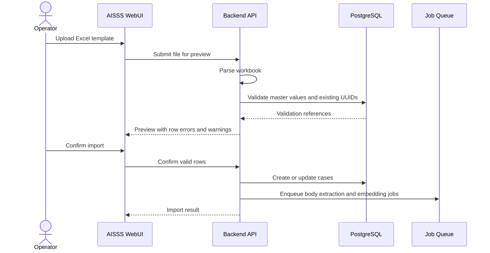

# Ingestion Design

## Purpose

Ingestion converts structured case input and attachments into searchable, auditable, permission-aware knowledge. It must preserve the original case record, original file, extracted text, and RAG chunks as separate layers.

## Supported Sources

| Source | Input Path | Output |
|---|---|---|
| Manual WebUI entry | Case form | Case metadata and body sections. |
| Excel template | Bulk import screen | One or more cases with validation results. |
| Office document | Attachment upload | Extracted text and attachment metadata. |
| PDF | Attachment upload | Parsed text and OCR fallback if needed. |
| Image | Attachment upload | OCR text. |
| Audio | Attachment upload | ASR transcript. |
| Manual audio transcript | Attachment or text field | Text linked to the case. |
| Standalone reference file | RAG 管理 → + 単独ファイル登録 | File metadata, extracted text, optional RAG enablement under 単独ファイル genre. |

## Excel Template

Use one row per case. The template should include:

- UUID column for updating existing cases. Blank means new registration.
- Display ID column for reference only.
- All case fields listed in [Requirements](./01-requirements.md).
- Separate columns for keyword1 to keyword6.
- Separate columns for body sections 1 to 4.
- Condition columns either as checkbox-like `TRUE/FALSE` columns or semicolon-separated condition names.
- Master sheets for controlled values.

Recommended sheets:

| Sheet | Purpose |
|---|---|
| `Cases` | Main input. |
| `Masters` | Current master values for dropdowns. |
| `Conditions` | Available condition labels and explanations. |
| `ViewingRanges` | Available viewing range labels. |
| `Instructions` | Operator guidance and version. |

## Import Flow

## Validation Rules

Hard errors:

- Missing required title.
- Invalid date format.
- End date earlier than start date.
- Unknown strict master value.
- UUID points to a case the operator cannot update.
- Viewing range is missing for restricted material.
- Unknown condition that is not allowed to auto-create.

Warnings:

- Duplicate material number.
- Unknown flexible keyword that will be auto-created.
- Empty body.
- Attachment referenced but not uploaded.
- Direct input used for viewing range notes without structured viewing range.

## Master Auto-Creation Policy

| Field Type | Recommended Policy |
|---|---|
| Rank, reliability, accuracy, handling type | Strict. Unknown values are errors. |
| Viewing range and condition | Strict by default. Operators manage first. |
| Keyword | Auto-create allowed with audit log. |
| Person name | Suggest existing values; auto-create may be allowed. |
| Region, source, category | Usually strict after initial setup. |

## Attachment Processing

Attachment upload has two phases:

1. Store original file and metadata.
2. Process text extraction asynchronously.

The case can be saved before extraction finishes. The WebUI should show per-attachment status.

## Office Parsing

Office parsing should extract:

- Plain text.
- Sheet names and cell text for spreadsheets.
- Slide text and speaker notes for presentations when supported.
- Basic document structure where available.

Do not treat Office macros as executable content. The initial implementation should parse documents as data only.

## PDF Parsing

PDF processing should:

- Extract embedded text first.
- Detect low-text or scanned PDFs.
- Run OCR fallback for scanned pages.
- Keep page numbers in extraction metadata for citations.

## Pilot Phase Decision (M17)

**Decision:** OCR and ASR remain **stubs for the limited pilot**. Image and audio attachments are accepted and stored, but extraction returns an explicit operator-visible error instead of silent empty text.

| Format | Pilot status | Operator workaround |
|---|---|---|
| PDF / DOCX / TXT | Supported | Upload directly. |
| XLSX / PPTX (legacy Office) | Stub | Convert to PDF or DOCX before upload. |
| Image (PNG/JPG) | Stub | Upload a manual transcript as `.txt`. |
| Audio (MP3/WAV) | Stub | Upload a manual transcript as `.txt`. |

**Post-MVP trigger:** enable OCR/ASR implementation when pilot feedback shows two or more real files blocked by stub extraction (see `19-operational-runbook.md` Post-MVP Cut Criteria).

**Future implementation path (not in pilot):**

1. OCR: Tesseract with `jpn` traineddata in the worker container, invoked only from `apps/workers/src/extract.js`.
2. ASR: local Whisper-compatible model in an isolated worker profile; no outbound network by default.
3. CI: add fixture-based extraction tests with synthetic PNG/audio samples; keep engines behind feature flags.

## OCR

OCR processing should:

- Store engine name and language settings.
- Keep confidence if the engine provides it.
- Preserve page or image identifiers.
- Allow manual correction or replacement of extracted text in later phases.

Japanese accuracy should be validated with representative documents before final engine selection.

## ASR

ASR processing should:

- Store transcript text.
- Store optional timestamps if available.
- Support manual transcript upload as a fallback.
- Avoid blocking case registration.

For restricted environments, prefer local Whisper-compatible models.

## Chunking and Embedding

Chunking should preserve metadata:

- Case UUID.
- Attachment ID.
- Source type.
- Page, slide, sheet, image, or audio time range when available.
- Viewing range and handling conditions.
- Rank, reliability, and accuracy.

Initial chunking should be simple and predictable:

- Split by section and paragraph first.
- Use token length limits after structural splitting.
- Avoid mixing different cases or attachments in a single chunk.

## Reprocessing

Reprocessing is required when:

- Case body changes.
- Attachment changes.
- Viewing range changes.
- Handling condition changes.
- Master labels affecting RAG metadata change.
- Extraction engine is upgraded.

For permission changes, update metadata and effective policies immediately. If vector DB metadata updates are unreliable, delete and recreate affected chunks.

## Operational Screens

The WebUI should provide:

- Import preview.
- Import history.
- Extraction job status.
- Failed job retry.
- RAG synchronization status.
- Per-case reindex action for operators.
