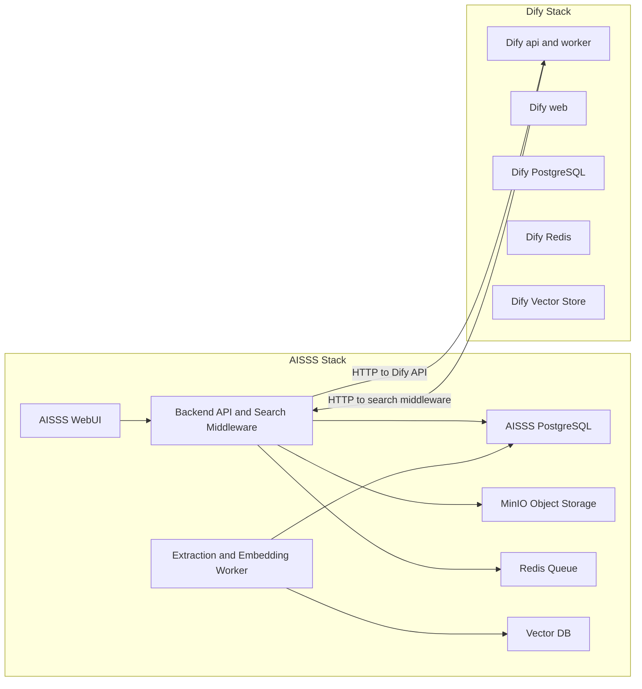

# Deployment: Docker Topology

## Decision Summary

AISSS and Dify run as two independent Docker Compose stacks connected by a shared external Docker network. They are not a single stack and do not share a database. This separation is intentional and is driven by maintenance, upgrade isolation, and the permission boundary.

See [ADR-003](./decisions/ADR-003-docker-two-stacks.md) for the rationale.

## Why Two Stacks

- Dify already ships as its own multi-container Compose stack. It should run unmodified so upgrades stay easy.
- AISSS must remain the source of truth and stay available even when Dify is restarted or upgraded.
- The permissioned search middleware lives in the AISSS stack, keeping the access-control boundary on the side that owns permissions.
- Backup and restore of AISSS data must be independent from Dify internal state.

## Topology



## Stack Responsibilities

| Stack | Services | Owns |
|---|---|---|
| AISSS | WebUI, backend API, search middleware, PostgreSQL, MinIO, Redis, workers, vector DB | Case records, files, permissions, audit, RAG index. |
| Dify | api, worker, web, db, redis, vector store, nginx, sandbox, ssrf_proxy | AI workflow, chat orchestration, prompt and app config. |

## Database Separation

Do not share PostgreSQL between AISSS and Dify.

- Dify uses its own `db` service from the official Dify Compose stack.
- AISSS uses its own PostgreSQL service.
- Sharing one database would couple schema migrations, backups, and failures across both systems and would break the maintenance benefit of separation.

## Shared Network

Both stacks attach to one external Docker network so containers can reach each other by service name over HTTP.

```bash
docker network create aisss-shared
```

- AISSS Compose joins `aisss-shared` as an external network.
- Dify Compose joins the same external network through an override file.
- Cross-stack communication uses HTTP APIs, not shared volumes or shared databases.

## Dify Stack Setup

Run Dify from its official Compose stack. Do not fork it into the AISSS repository.

1. Clone or vendor the official Dify `docker` directory outside the AISSS application code.
2. Add a small override file to attach Dify to `aisss-shared` and to set the search middleware URL.
3. Keep Dify environment values in Dify's own `.env`.

Recommended override file `dify/docker-compose.override.yaml`:

```yaml
networks:
  aisss-shared:
    external: true

services:
  api:
    networks:
      - default
      - aisss-shared
  worker:
    networks:
      - default
      - aisss-shared
```

## AISSS Stack Setup

The AISSS stack is defined in `aisss/docker-compose.yaml`. It builds WebUI, API, and worker images and runs PostgreSQL, MinIO, Redis, and the vector DB.

Environment values come from `aisss/.env`. Use `aisss/.env.example` as the template and never commit real secrets.

## One Command, Two Stacks

Separation does not prevent single-command startup. The repository `Makefile` wraps both stacks.

```bash
make net      # create the shared network once
make up       # start Dify stack, then AISSS stack
make down     # stop both stacks
make up-aisss # start only the AISSS stack
make up-dify  # start only the Dify stack
```

During maintenance you can restart one stack without touching the other.

## Startup Order

1. Create the shared network.
2. Start the AISSS stack so the search middleware is reachable.
3. Start the Dify stack and point its workflow at the AISSS search middleware URL.

If Dify starts before AISSS, AI search will fail until the middleware is available, but case management remains usable.

## Backup and Restore

- AISSS PostgreSQL: logical dump on a schedule.
- AISSS MinIO: bucket backup or replication.
- AISSS vector DB: rebuildable from PostgreSQL and MinIO, so treat it as recreatable.
- Dify: back up using Dify's own documented procedure, separately from AISSS.

## Operational Notes

- Pin image versions for both stacks to make upgrades deliberate.
- Upgrade Dify and AISSS independently and test the search middleware contract after each Dify upgrade.
- Keep the shared network name stable; both stacks depend on it.
- Expose only the WebUI, the Dify web, and required APIs through a reverse proxy in production.
