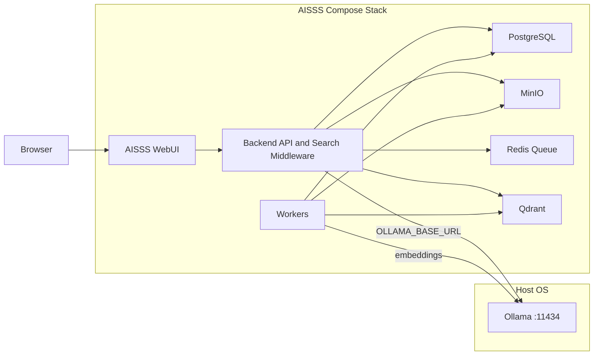

# Deployment: Docker Topology

## Decision Summary

AISSS runs as a **single Docker Compose stack**. Ollama runs on the **host** outside Compose and is reached via `OLLAMA_BASE_URL`.

See [ADR-004](./decisions/ADR-004-native-ollama-ai.md). ADR-003 (two-stack with Dify) is superseded.

## Topology



## Stack Services

| Service | Image / build | Role |
|---|---|---|
| `web` | `apps/web` | WebUI |
| `api` | `apps/api` | API, RAG middleware, Ollama proxy, AI chat |
| `worker` | `apps/workers` | Extraction, embedding, RAG sync |
| `db` | `postgres:16` | Source of truth |
| `redis` | `redis:7` | Job queue |
| `minio` | `minio/minio` | Object storage |
| `vector` | `qdrant/qdrant` | Vector index (rebuildable) |

## Host Ollama

Ollama is **not** a Compose service. Requirements:

1. Install and start Ollama on the host.
2. Pull required models (`nomic-embed-text`, chat model, optional rerank).
3. Set `OLLAMA_BASE_URL` in `aisss/.env`.

Default from containers:

```env
OLLAMA_BASE_URL=http://host.docker.internal:11434
```

On Linux, if `host.docker.internal` is unavailable, use the Docker bridge gateway (often `172.17.0.1`) or add `extra_hosts` to the `api` and `worker` services.

Ensure Ollama listens on an address reachable from containers. Verify with:

```bash
curl http://localhost:11434/api/tags
```

After AISSS API is running:

```bash
curl http://localhost:8000/api/ollama/health
```

## Quick Start

```bash
cp aisss/.env.example aisss/.env   # edit passwords and OLLAMA_BASE_URL
make up
```

Or:

```bash
docker compose -f aisss/docker-compose.yaml up -d
```

## Build cache (fast rebuild)

AISSS Dockerfiles follow [layer-cache best practices](https://eastondev.com/blog/ja/posts/dev/20251217-docker-build-cache/):

1. **`.dockerignore`** at repo root — excludes `node_modules/`, `.git/`, `docs/`, host `dist/`, etc. from build context.
2. **Stable-before-volatile COPY order** — `package.json` + lockfile → `npm install` → application source.
3. **BuildKit cache mounts** — `RUN --mount=type=cache,target=/root/.npm` on npm steps (`# syntax=docker/dockerfile:1` in each Dockerfile).

`Makefile` sets `DOCKER_BUILDKIT=1`. After **source-only** changes, rebuild only the affected service:

```powershell
make deploy-web     # apps/web
make deploy-api     # apps/api
make deploy-worker  # apps/workers
```

Use `make deploy` when Dockerfiles, lockfile, or multiple services change.

Confirm cache hits in build output (`CACHED` / `Using cache`). If `npm install` reruns on every UI tweak, check Dockerfile layer order (do not `COPY` full source before install).

See also `docs/19-operational-runbook.md` § Deploy verification and Cursor rule `56-aisss-docker-build-cache.mdc`.

## Environment

Copy [`aisss/.env.example`](../aisss/.env.example). Key variables:

- `DATABASE_URL`
- `OBJECT_STORAGE_*`
- `REDIS_URL`
- `VECTOR_DB_URL`
- `OLLAMA_BASE_URL`
- `OLLAMA_HEALTH_INTERVAL_SEC`

Never commit `aisss/.env`.

## Ports (defaults)

| Service | Host port |
|---|---|
| WebUI | 3000 |
| API | 8000 |
| MinIO API | 9000 |
| MinIO console | 9001 |
| Qdrant | 6333 |
| Ollama | 11434 (host only) |

## Backup

Back up independently:

- PostgreSQL volume (`aisss_postgres_data`)
- MinIO volume (`aisss_minio_data`)
- Optional: Qdrant volume (rebuildable from PG + MinIO)

Ollama models live on the host filesystem; back up the Ollama model directory if needed.

## Failure Isolation

| Failure | Effect |
|---|---|
| Ollama down | Case management works; AI search disabled; WebUI shows status |
| Qdrant down | Metadata search works; semantic AI search degraded |
| AISSS API down | Full application unavailable |
| Worker down | New extractions/embeddings queue; existing data intact |

## Production Notes

- Put TLS termination in front of WebUI/API.
- Restrict MinIO and Qdrant ports to internal networks in production.
- Do not expose Ollama to the public internet; only AISSS API/workers should reach it.
- Run permission regression tests after embedding or chat model changes.

## Related

- [Ollama Integration Guide](./15-ollama-integration.md)
- [Makefile](../Makefile)
