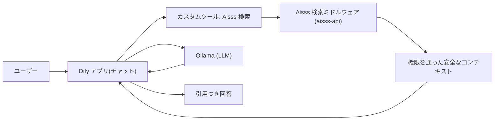

# Dify Integration Guide (初心者向け)

このガイドは、Dify を初めて触る人でも Aisss と連携できるように、画面操作レベルで手順を示します。専門用語は最小限にし、各ステップに「ここまでで何ができたか」のチェックポイントを置きます。

> 連携の心臓部は「**Dify が回答を作る前に、Aisss の検索ミドルウェアに問い合わせて、ユーザーが見てよい資料だけを取り出す**」ことです。これさえ守れば、AI 経由の情報漏れを防げます。

---

## 全体像(まずイメージをつかむ)



Dify 側でやることは、大きく 3 つだけです。

1. **LLM を登録する**(Ollama を Dify につなぐ)
2. **Aisss 検索をツールとして登録する**(カスタムツール)
3. **チャットフローを組む**(ユーザー入力 → Aisss 検索 → LLM → 回答)

---

## 事前準備

- Aisss スタックと Dify スタックが起動していること([Docker Topology](./13-deployment-docker.md))。
- 共有ネットワーク `aisss-shared` が作成済みで、両スタックが接続されていること。
- Dify に管理者アカウントでログインできること。
- Aisss 検索ミドルウェアが起動していること(`apps/api` 実装後)。本ガイドはエンドポイント [`POST /api/rag/search`](./09-api-design.md) を前提にします。

> ネットワーク上の名前(重要)
> - Dify から Aisss を呼ぶ URL: `http://aisss-api:8000`
> - Aisss から Dify を呼ぶ URL: `http://dify-api:5001`
> これらは共有ネットワーク上の **エイリアス** です([compose 設定](../aisss/docker-compose.yaml) / [Dify override](../dify/docker-compose.override.yaml))。サービス名 `api` の衝突を避けるために別名を付けています。

---

## ステップ 1: Ollama を Dify に登録する

LLM がないと回答を作れません。まず Ollama をモデルプロバイダとして登録します。

1. Dify 右上の **アカウントメニュー → 設定(Settings)** を開く。
2. 左メニューの **モデルプロバイダー(Model Provider)** を選ぶ。
3. 一覧から **Ollama** を探し、**追加(Add / Setup)** を押す。
4. 次の値を入力する。
   - **Model Name**: 使いたいモデル名(例: `llama3.1`、`qwen2.5` など、実際に `ollama pull` 済みのもの)。
   - **Base URL**:
     - Ollama を **ホスト PC** で動かしている場合 → `http://host.docker.internal:11434`
     - Ollama を **コンテナ** で動かしている場合 → そのサービス名(例: `http://ollama:11434`)
5. **保存(Save)** を押す。

> チェックポイント: モデル一覧に Ollama のモデルが表示されればOK。表示されない場合は Base URL とモデルのダウンロード状況を確認してください。

---

## ステップ 2: Aisss 検索をカスタムツールとして登録する

Dify からは「ツール」を経由して Aisss 検索ミドルウェアを呼びます。Dify のカスタムツールは **OpenAPI 形式のスキーマ** を貼り付けるだけで作れます。

1. 上部メニューの **ツール(Tools)** を開く。
2. **カスタム(Custom) → カスタムツールを作成(Create Custom Tool)** を押す。
3. **名前(例: `aisss_search`)** を入力する。
4. **スキーマ(Schema)** 欄に、次の OpenAPI を貼り付ける。

```yaml
openapi: 3.0.0
info:
  title: Aisss Permissioned Search
  version: "1.0.0"
servers:
  - url: http://aisss-api:8000
paths:
  /api/rag/search:
    post:
      operationId: aisss_search
      summary: 権限を考慮してケースを検索する
      requestBody:
        required: true
        content:
          application/json:
            schema:
              type: object
              required: [user_id, query]
              properties:
                user_id:
                  type: string
                  description: 信頼できるユーザー識別子
                query:
                  type: string
                  description: 検索したい質問文
                channel:
                  type: string
                  description: 呼び出し経路。Dify からは dify_chat を指定
                top_k:
                  type: integer
                  description: 取得件数
      responses:
        "200":
          description: 権限を通った安全なコンテキスト
          content:
            application/json:
              schema:
                type: object
                properties:
                  contexts:
                    type: array
                    items:
                      type: object
                  effective_policies:
                    type: object
```

5. **認証(Authentication)** を設定する。
   - MVP では `None` でも動きますが、本番では **API Key などのヘッダ認証** を必ず付けます(下記「セキュリティ」参照)。
6. **保存(Save)** を押す。

> チェックポイント: ツール一覧に `aisss_search` が表示され、テスト実行で `200` が返ればOK。返らない場合は URL(`http://aisss-api:8000`)とネットワーク接続を確認してください。

---

## ステップ 3: チャットフローを作る

ユーザーの質問を受けて、Aisss 検索 → LLM → 回答、という流れを組みます。

1. 上部メニューの **スタジオ(Studio)** を開く。
2. **アプリを作成(Create App) → 最初から(Blank) → チャットフロー(Chatflow)** を選ぶ。
3. 名前(例: `Aisss QA`)を付けて作成する。

これでノードを線でつなぐ編集画面が開きます。次のノードを順番に並べます。

### 3-1. Start ノード

- 既定で置かれています。ユーザーの入力(質問)がここから流れます。
- Dify が持つシステム変数 `sys.user_id` と `sys.query` を後段で使います。

### 3-2. ツール(Tool)ノード

1. `+` を押して **ツール(Tools) → `aisss_search`** を追加する。
2. パラメータを次のように割り当てる。
   - `query` ← `sys.query`(ユーザーの質問)
   - `user_id` ← `sys.user_id`(後述のとおり、信頼できる値を渡す)
   - `channel` ← 固定文字列 `dify_chat`
   - `top_k` ← `8` など
3. Start ノードと線でつなぐ。

### 3-3. LLM ノード

1. `+` を押して **LLM** を追加する。
2. **モデル** にステップ 1 で登録した Ollama モデルを選ぶ。
3. **コンテキスト(Context)** に、ツールノードの出力 `contexts` を割り当てる。
4. **プロンプト(System)** に次のような指示を入れる(取扱条件を尊重させる)。

```text
あなたは社内資料アシスタントです。
必ず提供された「コンテキスト」だけを根拠に回答してください。
コンテキストに無い情報は推測せず「該当資料なし」と答えてください。
effective_policies.quote_policy が summarize_only のときは、原文を逐語転記せず要約で答えてください。
回答の最後に、使用したケースの表示ID(display_id)を引用として列挙してください。
```

5. ツールノードと線でつなぐ。

### 3-4. Answer ノード

1. `+` を押して **回答(Answer)** を追加する。
2. 出力に LLM ノードの結果を割り当てる。
3. LLM ノードと線でつなぐ。

> チェックポイント: `Start → Tool(aisss_search) → LLM → Answer` が 1 本の線でつながっていればOK。

---

## ステップ 4: 動作確認

1. 画面右上の **プレビュー(Preview / Debug)** を開く。
2. テスト用に、権限のあるユーザーで質問してみる。
3. 次を確認する。
   - 回答が **コンテキストに基づいている**(引用 display_id が出る)。
   - 権限のない資料が **混ざらない**。
   - `照会禁止` のケースが **出てこない**。
4. 問題なければ **公開(Publish)** する。

公開後は、Aisss の WebUI からこの Dify アプリを埋め込む / API 経由で呼び出す形にします。

---

## セキュリティ(ここだけは必ず)

初心者向けに簡単化していますが、本番では以下を必ず満たしてください。詳細は [RAG Permission Design](./06-rag-permission-design.md) を参照。

- **user_id を信用しない**: Dify から渡る `sys.user_id` をそのまま信じると、なりすましで他人の権限の資料が取れてしまいます。Aisss WebUI から Dify を呼ぶ際に **署名付きトークン**(短命)を渡し、検索ミドルウェア側でトークンを検証して本物のユーザーに紐づけます。
- **ツール認証を付ける**: カスタムツールには API Key 等のヘッダ認証を設定し、ミドルウェアはキーを検証します。
- **権限判定は Aisss が正**: Dify 側のプロンプトだけで制限してはいけません。除外は検索段階(ミドルウェア)で行います。プロンプトは補助です。
- **Dify ネイティブのナレッジ検索を機微資料に使わない**: 権限を通さない検索経路を作らないこと。機微資料は必ずミドルウェア経由にします。

---

## トラブルシュート

| 症状 | 原因の候補 | 対処 |
|---|---|---|
| ツールテストが繋がらない | URL 違い / ネットワーク未接続 | `http://aisss-api:8000` か確認。両スタックが `aisss-shared` に接続済みか確認。 |
| `aisss-api` が名前解決できない | 共有ネットワーク未作成 | `docker network create aisss-shared`(`make net`)を実行し、両スタックを再起動。 |
| Ollama モデルが出ない | Base URL / pull 漏れ | ホストなら `http://host.docker.internal:11434`。`ollama pull <model>` 済みか確認。 |
| 回答に無関係資料が混ざる | コンテキスト未割り当て | LLM ノードの Context にツール出力 `contexts` を割り当てたか確認。 |
| 権限外資料が出る | user_id を信用している | 署名付きトークン方式に変更し、ミドルウェアで検証。 |

---

## まとめ(最短ルート)

1. 設定 → モデルプロバイダー → Ollama を追加。
2. ツール → カスタムツール → 上記スキーマを貼って `aisss_search` を作成。
3. スタジオ → チャットフロー → `Start → aisss_search → LLM → Answer`。
4. プレビューで権限を確認 → 公開。
5. 本番前に「署名付き user_id」と「ツール認証」を必ず追加。
