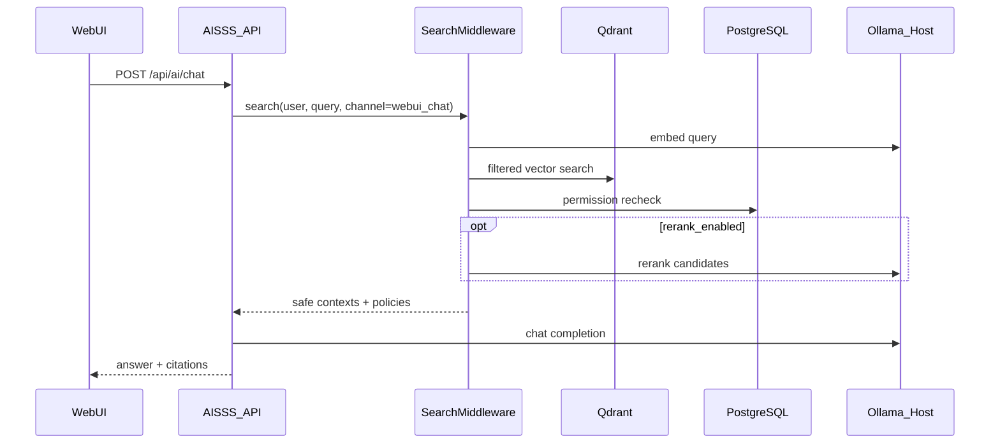

# Ollama Integration Guide

## Purpose

AISSS uses a **host Ollama** instance for embeddings, chat completion, and optional reranking. The API proxies Ollama; the WebUI never calls Ollama directly.

## Deployment Assumption

| Item | Value |
|---|---|
| Ollama location | Host OS (not in AISSS Compose) |
| Default URL | `http://host.docker.internal:11434` (from containers) |
| Env variable | `OLLAMA_BASE_URL` |
| Health poll interval | `OLLAMA_HEALTH_INTERVAL_SEC` (default `30`) |

On Linux hosts without `host.docker.internal`, set `OLLAMA_BASE_URL` to the host gateway IP or `http://172.17.0.1:11434`.

Ensure Ollama listens on an interface reachable from Docker (not only `127.0.0.1` if containers cannot reach it).

## Recommended Models

These are starting recommendations; adjust per hardware and language needs.

| Role | Example model | Used by |
|---|---|---|
| Embedding | `nomic-embed-text` | Embedding worker, query embedding in search |
| Chat | `llama3.2` or org-approved model | `/api/ai/chat` |
| ReRank (optional) | Org-approved rerank model pulled into Ollama | Search middleware when enabled |

Pull models on the host:

```bash
ollama pull nomic-embed-text
ollama pull llama3.2
```

Model pull remains a **host CLI** operation (`ollama pull`). Administrators may delete local models via `POST /api/admin/ollama/models/delete` (WebUI **削除** on `/models`), which proxies Ollama `DELETE /api/delete` and removes AISSS role rows.

## Model Roles (AISSS Configuration)

Stored in PostgreSQL or admin configuration:

| Field | Description |
|---|---|
| `default_chat_model` | Initial selection in AI search |
| `default_embedding_model` | Worker embedding jobs |
| `rerank_model` | Empty = ReRank off (ADR-005) |
| `enabled_chat_models[]` | Models users may select in chat |
| `rerank_enabled` | Boolean; effective only when `rerank_model` is set |

Administrators update roles via `PUT /api/admin/ollama/model-roles`.

**Runtime model loading (out of scope for AISSS):** Changing chat-enabled models or defaults updates PostgreSQL only. AISSS does not unload or preload models in host Ollama VRAM. While AI chat inference is active (`GET /api/ollama/inference-status`), the WebUI blocks chat-role edits and shows a notice to restart Ollama if operators must force a switch.

## API Contract

### Health

`GET /api/ollama/health`

Response:

```json
{
  "status": "ok",
  "latency_ms": 42,
  "ollama_version": "0.5.4",
  "checked_at": "2026-06-09T12:00:00Z"
}
```

`status` values: `ok`, `degraded` (slow response), `down` (unreachable).

### Model list

`GET /api/ollama/models`

Proxies Ollama `GET /api/tags` and merges AISSS role assignments.

```json
{
  "models": [
    {
      "name": "llama3.2:latest",
      "size_bytes": 2019393189,
      "modified_at": "2026-06-01T08:00:00Z",
      "roles": ["chat"],
      "enabled_for_chat": true
    },
    {
      "name": "nomic-embed-text:latest",
      "size_bytes": 274302450,
      "modified_at": "2026-06-01T08:00:00Z",
      "roles": ["embedding"],
      "enabled_for_chat": false
    }
  ],
  "defaults": {
    "chat_model": "llama3.2:latest",
    "embedding_model": "nomic-embed-text:latest",
    "rerank_model": null,
    "rerank_enabled": false
  }
}
```

### Model detail

`GET /api/ollama/models/{name}` — proxies Ollama show API for administrators.

### Admin model roles

`PUT /api/admin/ollama/model-roles` — administrator only.

### Delete local model

`POST /api/admin/ollama/models/delete` — administrator only. Body: `{ "model_name": "llama3.2:latest" }`. Proxies Ollama `DELETE /api/delete`, then removes `ollama_model_roles` row. Returns 409 if that model is currently used for AI chat inference.

## Embedding Flow (Workers)

1. Extraction worker stores normalized text in PostgreSQL.
2. Embedding worker chunks text (configurable size and overlap).
3. Worker calls Ollama `POST /api/embeddings` with `default_embedding_model`.
4. Worker upserts vectors and metadata into Qdrant.

Chunk defaults (configurable in RAG admin):

- `chunk_size`: 800 tokens (approximate)
- `chunk_overlap`: 120 tokens

## Chat Flow (`/api/ai/chat`)



Request:

```json
{
  "message": "2026年1月の東アジア情勢について",
  "model": "llama3.2:latest",
  "conversation_id": "optional-uuid",
  "filters": {}
}
```

Response:

```json
{
  "answer": "…",
  "citations": [
    {
      "display_id": "CASE-2026-00142",
      "title": "東アジア情勢に関する月次分析",
      "policies": { "quote_policy": "summarize_only", "export_policy": "deny_print" }
    }
  ],
  "effective_policies": {
    "quote_policy": "summarize_only",
    "export_policy": "deny_print"
  },
  "model": "llama3.2:latest"
}
```

Streaming: `POST /api/ai/chat/stream` — Server-Sent Events with the same permission pipeline before tokens stream.

System prompt must respect `effective_policies.quote_policy` (for example, no long verbatim quotes when `summarize_only`).

## ReRank (Optional)

See [ADR-005](./decisions/ADR-005-rerank-optional.md).

When enabled:

- Vector search uses `candidate_top_k` (e.g. 20).
- Rerank model scores passages against the query.
- Final `top_k` (e.g. 8) goes to the LLM.

Concurrent rerank operations: limit to **1** in the initial implementation.

## WebUI Integration

| Surface | Behavior |
|---|---|
| Header / sidebar | Ollama status indicator (ok / degraded / down) |
| AI search | Model dropdown from `enabled_chat_models`; disable input when down |
| Model management | Full model table, role assignment, ReRank toggle |
| RAG admin | Shows embedding model name (read-only for operators) |

## Security

- Only AISSS API and workers hold `OLLAMA_BASE_URL`.
- No Ollama admin endpoints exposed to browsers.
- All chat requests require authenticated AISSS sessions.
- Audit log records `ai_query` with user, model, retrieved case IDs, and channel.

## Troubleshooting

| Symptom | Check |
|---|---|
| AI search disabled | `GET /api/ollama/health` from API container |
| Empty model list | Ollama running on host; models pulled |
| Embedding jobs fail | `default_embedding_model` exists in Ollama |
| Slow answers | Host GPU/CPU; reduce `top_k` or disable ReRank |

## Related

- [RAG Admin Guide](./16-rag-admin-guide.md)
- [API Design](./09-api-design.md)
- [RAG Permission Design](./06-rag-permission-design.md)
