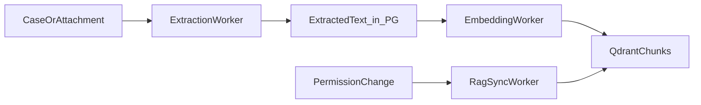

# RAG Admin Guide

## Purpose

The **RAG 管理** screen is the operator dashboard for the ingestion and indexing pipeline. It replaces the operational visibility that a separate knowledge-base tool (formerly Dify) would have provided, while keeping **case registration and attachment upload** in their existing screens.

All indexed content originates from AISSS cases and attachments. There is no parallel direct-upload knowledge path.

## Who Can Access

| Role | Access |
|---|---|
| Administrator | Full: settings, reindex, delete vectors, job retry |
| Operator | View status, retry failed jobs, trigger reindex |
| General user | No access to RAG admin |

## Pipeline Overview

Three layers (see [Ingestion Design](./07-ingestion-design.md)):

1. **Case record** — metadata and body in PostgreSQL.
2. **Extracted text** — per attachment or body section.
3. **RAG chunks** — vectors in Qdrant with permission metadata.

## Screen Sections

### Summary

| Metric | Source |
|---|---|
| Indexed chunk count | `GET /api/rag/status` |
| Cases pending extraction | Job queue + case flags |
| Cases pending embedding | Job queue |
| Failed jobs (24h) | `GET /api/jobs?status=failed` |
| Last successful sync | RAG status API |

### Ingestion Status by Case

Table columns:

- Display ID / 表題
- Extraction status (pending / running / done / failed)
- Embedding status
- RAG sync status
- Attachment count
- Actions: 再抽出 / 再インデックス

Filter by status, 資料区分, date range.

### Queue by File Type

| Type | Worker path |
|---|---|
| Office | `extraction` → LibreOffice or equivalent |
| PDF | `extraction` → parser + OCR fallback |
| Image | OCR |
| Audio | ASR or manual transcript |

Shows queue depth and oldest waiting job per type.

### Failed Jobs

Integrated with [Job APIs](./09-api-design.md):

- `GET /api/jobs?type=extraction|embedding|rag_sync&status=failed`
- `POST /api/jobs/{job_id}/retry`

### Settings (Administrators)

| Setting | Default | Notes |
|---|---|---|
| Chunk size | ~800 tokens | Affects new embeddings |
| Chunk overlap | ~120 tokens | Affects new embeddings |
| Embedding model | `nomic-embed-text` | Must match Ollama pull |
| ReRank enabled | `false` | Requires `rerank_model` in model admin |
| Candidate top_k (rerank) | 20 | Used only when ReRank on |
| Final top_k | 8 | Chunks passed to LLM |

Changing chunk or model settings does not automatically reindex all cases. Administrators run bulk reindex from this screen when needed.

## Common Operations

### New attachment uploaded

Automatic: upload → extraction job → embedding job → vector upsert. No RAG admin action required unless monitoring.

### Extraction failed

1. Open failed job detail.
2. Review error (corrupt file, unsupported format).
3. Fix source or re-upload attachment.
4. **再抽出** on attachment or retry job.

### Permission or viewing range changed

`rag_sync` worker updates vector metadata or removes chunks. If sync lags, operator triggers **再インデックス** on the case.

### Case soft-deleted

Vectors for that case are removed asynchronously. RAG admin shows cleanup job status.

### Bulk reindex after config change

Administrator selects case range or “all failed / stale” and confirms. Creates background embedding jobs; audit log records the action.

## APIs Used by This Screen

| Method | Path | Purpose |
|---|---|---|
| `GET` | `/api/rag/status` | Dashboard metrics |
| `GET` | `/api/rag/cases/{case_id}/sync-state` | Per-case pipeline state |
| `GET` | `/api/jobs` | Job list and filters |
| `POST` | `/api/jobs/{job_id}/retry` | Retry |
| `POST` | `/api/cases/{case_id}/reindex` | Re-embed case |
| `POST` | `/api/attachments/{attachment_id}/retry-extraction` | Re-extract file |
| `DELETE` | `/api/cases/{case_id}` | Triggers vector cleanup |

## Office and PDF “DB化”

There is no separate upload form in RAG admin. Office and PDF become searchable through:

1. Register or update a case (WebUI or Excel import).
2. Attach Office/PDF files on the case.
3. Workers extract text → embed → sync to Qdrant.

RAG admin **monitors and re-runs** this pipeline; it does not replace case registration.

## Relation to Model Management

| Concern | Screen |
|---|---|
| Which embedding model | モデル管理 (role: embedding) |
| Which chat model | モデル管理 (role: chat) |
| ReRank on/off and model | モデル管理 + RAG admin toggle display |
| Ollama reachable | モデル管理 + global health indicator |

## Audit

Log actions:

- Bulk reindex started/completed
- Manual reindex per case
- Extraction retry
- RAG setting changes

## Related

- [Ollama Integration Guide](./15-ollama-integration.md)
- [Ingestion Design](./07-ingestion-design.md)
- [WebUI Design](./08-webui-design.md)
