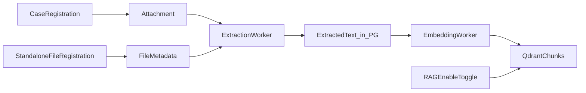

# RAG Admin Guide

> Mock: `view-rag-admin` in [webui.html](../mockups/webui.html). Operator flow: [18 § Flow C](./18-webui-mock-inventory-and-flows.md#flow-c-standalone-file--rag--ai-citation).

## Purpose

The **RAG 管理** screen is the operator dashboard for browsing registered files, monitoring extraction/embedding, and toggling which files are included in the vector index (AI search).

Files enter the system through two registration paths. RAG 管理 does not replace registration; it organizes and governs what becomes searchable.

## Registration Paths

| Path | Where to register | Appears in RAG tree as |
|---|---|---|
| Case attachment | 登録 → **ケース（事象）** (attach on case form) | **ケース（事象）** → 細部 group → file |
| Standalone reference file | **+ 単独ファイル登録** on RAG 管理 | **単独ファイル（参照資料）** → 細部 group → file |

Both paths run the same pipeline: store file → extract text → embed → optional RAG enablement.

Standalone files carry minimal metadata (title/group, tags, viewing range) but still require permission metadata before AI search.

## Screen Layout

```text
[RAG 管理]
├── Stats (chunks, queue, failures)
├── Left: **RAGの体系管理** (genre → group → file tree with ㋹ checkboxes)
└── Right: Unified list (title, tag, date, 閲覧範囲 filters + 閲覧範囲 column + pipeline + ㋹ toggle)
```

### RAGの体系管理 (left tree)

| Level | Example | Notes |
|---|---|---|
| ジャンル | ケース（事象）, 単独ファイル（参照資料） | Top-level genre; rules TBD after mock review |
| 細部 | 2025年度経理データ, ●山の自然 | Grouping folder; may map to case title or standalone title |
| ファイル | 2025年度.xlsx, 植物.pdf | Leaf; nested siblings allowed (e.g. 河川名.xlsx under same 細部) |

Each tree row has a ㋹ checkbox. Checking a parent (e.g. **●山の自然**) cascades to all enabled file children (e.g. 植物.pdf, 河川名.xlsx) and syncs the file list on the right. Parent shows indeterminate when only some children are enabled.

### File list (unified)

- Filter by title, tags, date range, and **閲覧範囲**.
- Each row shows **閲覧範囲**, pipeline status, and ㋹ RAG toggle together.
- Case attachments show inherited viewing range with **ケース継承** badge; click warns to change on case form.
- Standalone files allow editing viewing range in the list (save triggers metadata resync).
- Only files with successful extraction (and embedding when required) can enable ㋹.
- Enabled files are synced to Qdrant; disabled files remain stored but excluded from AI retrieval.
- Failed extraction shows **再抽出** on the same row.
- Every row has **削除**; confirmation warns that registration, extracted text, and Qdrant vectors are permanently removed.

## Pipeline Overview



## Who Can Access

| Role | Access |
|---|---|
| Administrator | Full: RAG toggle, reindex, settings |
| Operator | View tree, search, enable RAG, retry jobs |
| General user | No access to RAG admin |

## APIs Used

| Method | Path | Purpose |
|---|---|---|
| `GET` | `/api/rag/status` | Dashboard metrics |
| `GET` | `/api/rag/tree` | Genre / group / file tree (planned) |
| `GET` | `/api/rag/files` | Filtered file list |
| `PATCH` | `/api/rag/files/{id}/enable` | Set RAG 有効化 (㋹) |
| `POST` | `/api/rag/standalone-files` | Standalone file registration |
| `PATCH` | `/api/rag/standalone-files/{id}/viewing-ranges` | Update standalone viewing range from RAG admin |
| `POST` | `/api/cases/{case_id}/reindex` | Re-embed case attachments |
| `POST` | `/api/jobs/{job_id}/retry` | Retry failed extraction |

## Common Operations

### Register a file on a case

1. 登録 → ケース（事象）.
2. Attach Office/PDF/etc.
3. Save case.
4. Open 管理 → RAG 管理; file appears under ケース（事象） tree.
5. After extraction succeeds, enable ㋹ on the same RAG 管理 list if needed.

### Register a standalone file

1. RAG 管理 → **+ 単独ファイル登録**.
2. Enter title (細部), tags, viewing range; upload file.
3. Save; extraction job starts.
4. Enable ㋹ on the file row when ready for AI search.

### Verify viewing range after registration

1. Register a case with viewing range A and attachments (step 1 in [Viewing Range Permission Flow](./17-viewing-range-permission-flow.md)).
2. Register a standalone file with viewing range B.
3. Open RAG 管理 → check **閲覧範囲** column (A + ケース継承 / B editable).
4. Use **閲覧範囲** filter to show only A or B.

### Extraction failed

Find the file in the list → **再抽出** → re-enable ㋹ after success.

## Open Design Items

- Exact 細部 grouping rules for case attachments (per case vs per attachment set).
- Whether ㋹ default is ON or OFF for new files.
- Tree API shape and pagination for large corpora.

## Mock Tree Structure (demo)

The HTML mock uses two top-level genres under **RAGの体系管理**:

| ジャンル | Example 細部 groups | Example files |
|---|---|---|
| ケース（事象） | 2025年度経理データ, ●山の自然, ハリウッド俳優 | `.xlsx`, `.pdf` attachments |
| 単独ファイル（参照資料） | 参考資料2026 | 条例案.pdf |

Demo case IDs for **ケースを開く**: `CASE-YAMA`, `CASE-HOLLYWOOD`, `CASE-2025-KEIRI`, `CASE-2026-KEIRI` — see [18 cross-reference](./18-webui-mock-inventory-and-flows.md#demo-display-id-cross-reference).

## Related

- [WebUI Mock Inventory and Flows](./18-webui-mock-inventory-and-flows.md)
- [Viewing Range Permission Flow](./17-viewing-range-permission-flow.md)
- [WebUI Design](./08-webui-design.md)
- [Sequence Diagrams](./03-sequence-diagrams.md) — RAG delete, standalone registration
- [Ingestion Design](./07-ingestion-design.md)
- [Ollama Integration Guide](./15-ollama-integration.md)
