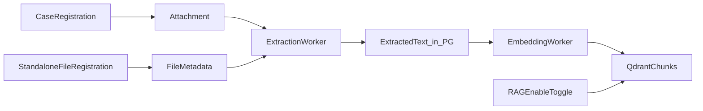

# RAG Admin Guide

## Purpose

The **RAG 管理** screen is the operator dashboard for browsing registered files, monitoring extraction/embedding, and toggling which files are included in the vector index (AI search).

Files enter the system through two registration paths. RAG 管理 does not replace registration; it organizes and governs what becomes searchable.

## Registration Paths

| Path | Where to register | Appears in RAG tree as |
|---|---|---|
| Case attachment | 登録 → **ケース（事象）** (attach on case form) | **ケース（事象）** → 細部 group → file |
| Standalone reference file | 登録 → **単独ファイル（参照資料）**, or **+ 単独ファイル登録** on RAG 管理 | **単独ファイル（参照資料）** → 細部 group → file |

Both paths run the same pipeline: store file → extract text → embed → optional RAG enablement.

Standalone files carry minimal metadata (title/group, tags, viewing range) but still require permission metadata before AI search.

## Screen Layout

```text
[RAG 管理]
├── Stats (chunks, queue, failures)
├── Left: Tree — ジャンル → 細部 → ファイル
└── Right: Unified list (title, tag, date filters + pipeline status + ㋹ toggle per file)
```

### Tree levels

| Level | Example | Notes |
|---|---|---|
| ジャンル | ケース（事象）, 単独ファイル（参照資料） | Top-level genre; rules TBD after mock review |
| 細部 | 2025年度経理データ, ●山の自然 | Grouping folder; may map to case title or standalone title |
| ファイル | 2025年度.xlsx, 植物.pdf | Leaf; nested siblings allowed (e.g. 河川名.xlsx under same 細部) |

### File list (unified)

- Filter by title, tags, date range (same bar as before).
- Each row shows pipeline status and ㋹ RAG toggle together.
- Only files with successful extraction (and embedding when required) can enable ㋹.
- Enabled files are synced to Qdrant; disabled files remain stored but excluded from AI retrieval.
- Failed extraction shows **再抽出** on the same row.

## Pipeline Overview



## Who Can Access

| Role | Access |
|---|---|
| Administrator | Full: RAG toggle, reindex, settings |
| Operator | View tree, search, enable RAG, retry jobs |
| General user | No access to RAG admin |

## APIs Used

| Method | Path | Purpose |
|---|---|---|
| `GET` | `/api/rag/status` | Dashboard metrics |
| `GET` | `/api/rag/tree` | Genre / group / file tree (planned) |
| `GET` | `/api/rag/files` | Filtered file list |
| `PATCH` | `/api/rag/files/{id}/enable` | Set RAG 有効化 (㋹) |
| `POST` | `/api/rag/standalone-files` | Standalone file registration |
| `POST` | `/api/cases/{case_id}/reindex` | Re-embed case attachments |
| `POST` | `/api/jobs/{job_id}/retry` | Retry failed extraction |

## Common Operations

### Register a file on a case

1. 登録 → ケース（事象）.
2. Attach Office/PDF/etc.
3. Save case.
4. Open 管理 → RAG 管理; file appears under ケース（事象） tree.
5. After extraction succeeds, enable ㋹ on the same RAG 管理 list if needed.

### Register a standalone file

1. 登録 → 単独ファイル（参照資料） (or RAG 管理 → + 単独ファイル登録).
2. Enter title (細部), tags, viewing range; upload file.
3. Save; extraction job starts.
4. Enable ㋹ on the file row when ready for AI search.

### Extraction failed

Find the file in the list → **再抽出** → re-enable ㋹ after success.

## Open Design Items

- Exact 細部 grouping rules for case attachments (per case vs per attachment set).
- Whether ㋹ default is ON or OFF for new files.
- Tree API shape and pagination for large corpora.

## Related

- [WebUI Design](./08-webui-design.md)
- [Ingestion Design](./07-ingestion-design.md)
- [Ollama Integration Guide](./15-ollama-integration.md)
