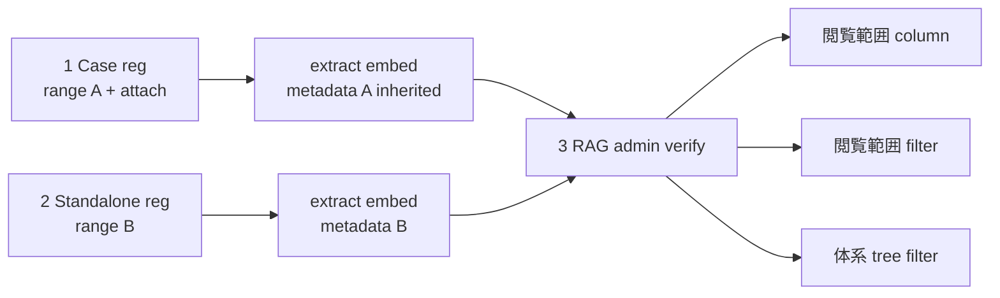
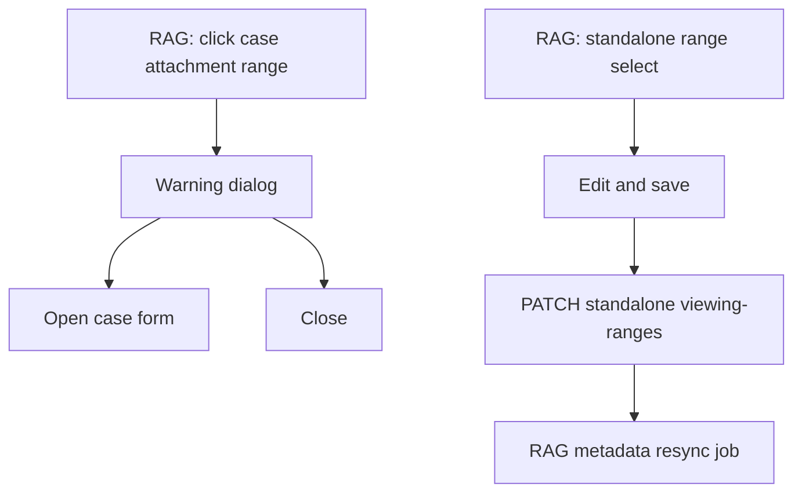
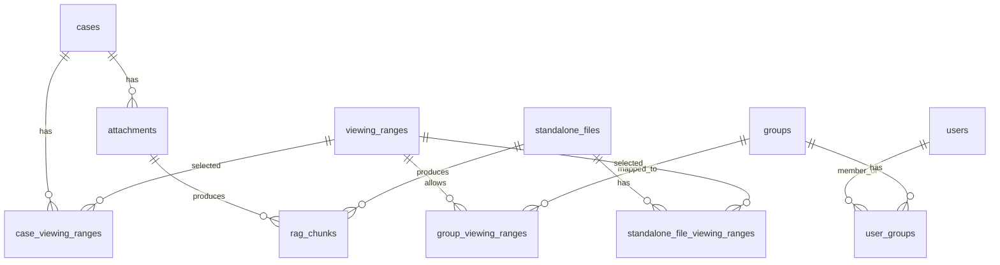
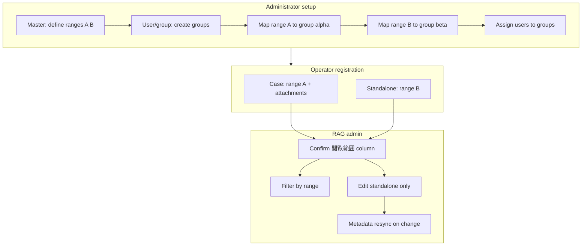

# Viewing Range Permission Flow

## Purpose

This document describes how **閲覧範囲** (viewing ranges) flow from administrator setup through case/standalone registration to RAG administration and AI search. It answers the operator question: *after registering files with ranges A and B, how do I verify them in RAG 管理?*

Related documents:

- [RAG Permission Design](./06-rag-permission-design.md)
- [Data Model](./05-data-model.md)
- [WebUI Design](./08-webui-design.md)
- [RAG Admin Guide](./16-rag-admin-guide.md)
- [API Design](./09-api-design.md)

## User Operation Flow (Steps 1–3)

### Prerequisites (administrator)

1. **マスタ管理** — define viewing range labels (e.g. A = `分析担当者のみ`, B = `分析第一課`).
2. **ユーザー・グループ管理** — create groups; map ranges to groups via `group_viewing_ranges`; assign users to groups via `user_groups`.

### Step 1: Case registration with attachment (range A)

1. 登録 → **ケース（事象）**.
2. Set **閲覧範囲** to A (e.g. `分析担当者のみ`).
3. Attach files and save the case.
4. Extraction runs; attachments inherit the case viewing range (not per-file ACL).

### Step 2: Standalone file registration (range B)

1. 管理 → **RAG 管理** → **+ 単独ファイル登録**.
2. Set **閲覧範囲** to B (e.g. `分析第一課`).
3. Upload file and save.
4. File appears under **単独ファイル（参照資料）** in RAGの体系管理.

### Step 3: Verify in RAG 管理

1. Open **RAG 管理**.
2. Check the **閲覧範囲** column in the file list:
   - Case attachments: range label + **ケース継承** badge (read-only).
   - Standalone files: range label in an editable select.
3. Use the **閲覧範囲** filter to show only A or B.
4. Select a tree node in **RAGの体系管理** to narrow the list.

## Registration Path vs Viewing Range Source

| Path | Viewing range source | RAG list display | Edit in RAG admin |
|---|---|---|---|
| Case attachment | Parent `case_viewing_ranges` (all attachments inherit) | Label + **ケース継承** badge | **No** — warning dialog |
| Standalone file | `standalone_file_viewing_ranges` | Editable select | **Yes** — save applies PATCH |

### Why case attachments cannot be changed per file in RAG admin

Viewing range is case-level metadata. The case body, all attachments, and RAG chunks for that case share the same ACL. Changing only one attachment in RAG admin would desynchronize the case record, other attachments, and permission middleware checks.

**Guard behavior (case attachment rows):**

- Display is read-only text (not a select).
- Clicking the range or an edit affordance opens a warning dialog:
  - *閲覧範囲はケース（事象）単位で設定されています。ファイル単位では変更できません。変更する場合はケースの登録・編集画面で行ってください。*
  - Actions: **ケースを開く** (navigate to case edit) / **閉じる**
- API rejects `PATCH` on `case_attachment` sources with **409 Conflict** (`change_on_case_form`).

## Linkage with User and Group Management

### Authority model

### Permission evaluation (summary)

1. Load user groups from `user_groups`.
2. Resolve allowed viewing range IDs from `group_viewing_ranges`.
3. Compare with `viewing_range_ids` on the case or standalone file.
4. Apply handling conditions and channel policies ([RAG Permission Design](./06-rag-permission-design.md)).
5. `rag_chunks.metadata_json.viewing_range_ids` is a filter copy; **PostgreSQL remains authoritative**.

### Administrator → operator flow

### Screen responsibilities

| Screen | Viewing range responsibility |
|---|---|
| **マスタ管理** | CRUD for `viewing_ranges` labels (name, code, active) |
| **ユーザー・グループ管理** | Groups, user membership, `group_viewing_ranges` mapping |
| **ケース登録** | Set `case_viewing_ranges` (attachments inherit) |
| **単独ファイル登録** | Initial `standalone_file_viewing_ranges` |
| **RAG 管理** | View all; edit standalone only; warn on case attachment edit attempt; filter |

Permission changes trigger audit logs and RAG metadata resync per [Sequence Diagrams](./03-sequence-diagrams.md) (Viewing Range or Condition Change).

## APIs

| Method | Path | Purpose |
|---|---|---|
| `GET` | `/api/viewing-ranges` | List viewing ranges |
| `POST` | `/api/viewing-ranges` | Create viewing range |
| `PUT` | `/api/viewing-ranges/{id}/groups` | Map range to groups |
| `GET` | `/api/rag/files` | File list with `viewing_range_ids`, `viewing_range_labels`, `source_kind`, `editable_viewing_range` |
| `PATCH` | `/api/rag/standalone-files/{id}/viewing-ranges` | Update standalone file range from RAG admin |
| — | `case_attachment` PATCH | **Rejected** — 409 `change_on_case_form` |

### `GET /api/rag/files` response fields (per row)

| Field | Type | Notes |
|---|---|---|
| `source_kind` | string | `case_attachment` or `standalone` |
| `viewing_range_ids` | UUID[] | Effective range IDs |
| `viewing_range_labels` | string[] | Display labels |
| `editable_viewing_range` | boolean | `true` only for standalone |
| `case_id` | UUID, nullable | Set for case attachments (for “open case” link) |

## Open Questions

- Whether multiple viewing ranges per case/standalone are allowed in v1 (data model supports many-to-many; UI may start single-select).
- Whether RAG admin should show mapped group names as a tooltip (recommended for operators).
