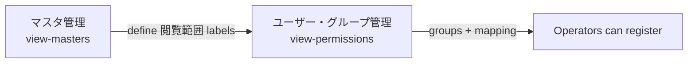
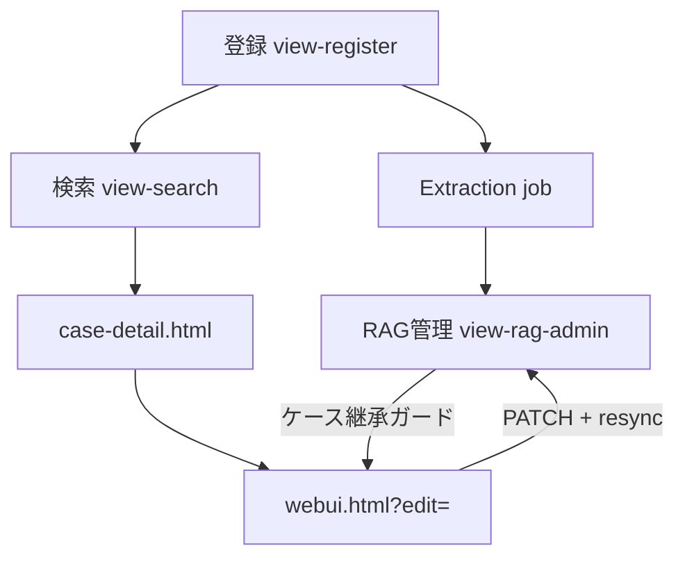
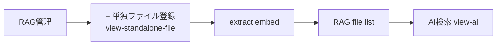
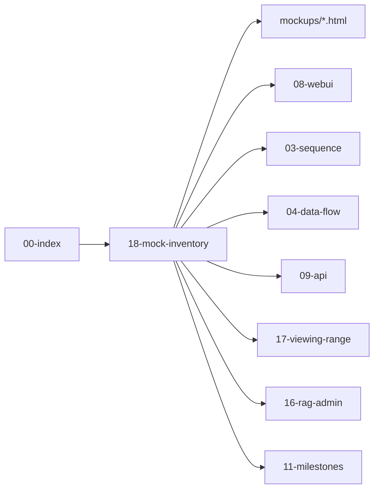

# WebUI Mock Inventory and Flows

## Purpose

This document is the **hub** for the static HTML mockups. It inventories what each screen implements today, links operator journeys across documents, and records gaps between the mock and the full specification.

Use this document when you need to know: *which screen does what*, *which API it will call*, and *which milestone it supports*.

Related documents:

- [WebUI Design](./08-webui-design.md) — full screen specification
- [Viewing Range Permission Flow](./17-viewing-range-permission-flow.md) — 閲覧範囲 operator steps 1–3
- [RAG Admin Guide](./16-rag-admin-guide.md) — RAG 管理 operations
- [Sequence Diagrams](./03-sequence-diagrams.md) — API timing
- [Data Flow](./04-data-flow.md) — stores and freshness
- [API Design](./09-api-design.md) — endpoint contracts
- [Milestones](./11-milestones.md) — implementation phases

Interactive mockups:

- [webui.html](../mockups/webui.html) — main shell (all views)
- [case-detail.html](../mockups/case-detail.html) — case read view (separate window/tab)

## Mock Files

| File | Role | Entry |
|---|---|---|
| `mockups/webui.html` | Single-page shell; `showView(id)` switches sections | Open directly or `webui.html?edit={display_id}` |
| `mockups/case-detail.html` | Read-only case detail | `case-detail.html?case={display_id}` |

### View IDs in `webui.html`

| `showView(id)` | DOM section | Sidebar path |
|---|---|---|
| `search` | `#view-search` | 検索 → ケース（事象） |
| `register` | `#view-register` | 登録 → ケース（事象） |
| `ai` | `#view-ai` | 検索 → AI 検索 |
| `standalone-file` | `#view-standalone-file` | RAG 管理 → + 単独ファイル登録 (no sidebar item) |
| `rag-admin` | `#view-rag-admin` | 管理 → RAG 管理 |
| `models` | `#view-models` | 管理 → モデル管理（API 連携） |
| `permissions` | `#view-permissions` | 管理 → ユーザー・グループ管理 |
| `masters` | `#view-masters` | 管理 → マスタ管理 |
| `audit` | `#view-audit` | 管理 → 監査ログ |
| `jobs` | `#view-jobs` | 管理 → ジョブ状態 |

### URL parameters

| Parameter | Screen | Behavior |
|---|---|---|
| `?edit={display_id}` | `view-register` | Loads `CASE_EDIT_RECORDS[display_id]` into the registration form (edit mode) |
| `?view=jobs&filter=failed` | `view-jobs` | Opens jobs view with status filter |
| `?view=audit&case={display_id}` | `view-audit` | Opens audit log filtered by case/query ID |
| `?case={display_id}` | `case-detail.html` | Loads `CASES[display_id]` for read view |

**Display ID vs UUID:** The mock uses human-facing `display_id` values (e.g. `CASE-2026-00142`) in URLs and citations. Internal `cases.id` UUIDs are not shown. See [Data Model](./05-data-model.md).

## Screen Completeness Matrix

| Screen | Mock view | Completeness | Spec | Primary APIs | Milestone |
|---|---|---|---|---|---|
| ケース検索 | `search` | Medium (4-row filter layout fixed) | [08 § Case Search](./08-webui-design.md) | `GET /api/cases` | M2 |
| ケース登録・編集 | `register` | Medium–High (vertical body stack fixed) | [08 § Registration](./08-webui-design.md) | `POST` / `PATCH /api/cases/{id}` | M2 |
| ケース詳細 | `case-detail.html` | Medium | [08 § Case detail](./08-webui-design.md) | `GET /api/cases/{id}` | M2 |
| AI 検索 | `ai` | Low (static) | [08 § AI Search](./08-webui-design.md) | `POST /api/ai/chat`, `GET /api/ollama/health` | M5 |
| 単独ファイル登録 | `standalone-file` | Low | [16 § Registration](./16-rag-admin-guide.md) | `POST /api/rag/standalone-files` | M5 |
| RAG 管理 | `rag-admin` | High | [16](./16-rag-admin-guide.md), [17](./17-viewing-range-permission-flow.md) | `GET /api/rag/*`, `PATCH` enable / viewing-ranges | M5 |
| モデル管理 | `models` | Medium (static) | [15](./15-ollama-integration.md) | `GET /api/ollama/models`, `PUT /api/admin/ollama/model-roles` | M5 |
| ユーザー・グループ | `permissions` | Medium | [08 § Permission](./08-webui-design.md), [17](./17-viewing-range-permission-flow.md) | `GET/PUT /api/users`, `/api/groups`, `/api/viewing-ranges` | M2 |
| マスタ管理 | `masters` | Low | [08 § Master](./08-webui-design.md) | `GET/POST/PATCH /api/masters/{name}` | M2 |
| 監査ログ | `audit` | Medium (2-row filter layout fixed) | [08 § Audit](./08-webui-design.md) | `GET /api/audit-logs` | M6 |
| ジョブ状態 | `jobs` | Medium | [08 § Job Status](./08-webui-design.md) | `GET /api/jobs`, retry | M6 |

### Interactive features implemented in the mock

| Feature | Screens | Notes |
|---|---|---|
| Sidebar collapse | All | `localStorage` key `aisss-sidebar-collapsed` |
| Search filter collapse | `search` | `aisss-search-filter-collapsed` |
| Sortable table headers | `search`, `rag-admin`, `models`, `masters`, `permissions` | Click column header to sort |
| Excel import simulation | `register` | File pick → `fillFormFromExcel()` toast; no preview/confirm |
| Case edit mode | `register` | `?edit=` + `CASE_EDIT_RECORDS`; hides Excel import; **更新する** |
| RAG tree cascade | `rag-admin` | Parent ㋹ checks cascade; indeterminate state; file counts |
| Tag input with history | `standalone-file`, `rag-admin` | `localStorage` tag history |
| RAG delete dialog | `rag-admin` | Confirms irreversible removal |
| Case viewing-range guard | `rag-admin` | Dialog → **ケースを開く** → `?edit=` |
| Permission tabs | `permissions` | ユーザー / グループ / 閲覧範囲マッピング |
| Audit log detail | `audit` | Row click / **詳細** → dialog; follow to AI or case edit |
| Jobs cross-nav | `search`, `rag-admin` | Stats cards → `view-jobs` with filter |
| Job retry | `jobs` | **再試行** → toast; row status → pending |
| Jobs ↔ audit | `jobs` | **監査** button → `view-audit` filtered by case |

## Mock Layout Conventions

Fixed DOM layout patterns in `webui.html`. Read view (`case-detail.html`) is unchanged — joined body display.

| Screen | View ID | Container / classes | Row layout | Persistence |
|---|---|---|---|---|
| ケース検索 | `view-search` | `#searchFilterPanel`, `search-filter-panel` | **4 rows:** ① keyword full width (`search-filter-keyword`) ② 資料区分·登録部署·ランク (`search-filter-masters`) ③ 閲覧範囲 full width (`search-filter-viewing`) ④ 検索 button (`search-filter-actions`) | Collapse: `localStorage` `aisss-search-filter-collapsed`; expanded `max-height` only when `:not(.collapsed)` |
| ケース登録 | `view-register` | `form-body-stack` | **4 fields vertical:** 要約 → 記事 (tall, `rows=8` / `min-height: 160px`) → 所見 → その他参考 | — |
| 監査ログ | `view-audit` | `audit-filter-panel`, `audit-filter-row` | **2 rows:** ① ユーザー·アクション·日付範囲 (`audit-date-range`) ② 表示 ID/クエリ ID·絞り込み | — |
| ジョブ状態 | `view-jobs` | (existing jobs filter) | No layout change this cycle | `?view=jobs&filter=` deep link |

Search stats cards that show pipeline counts link to `view-jobs` (see [08 § Job Status](./08-webui-design.md)).

## Operator Flows

These flows complement [Viewing Range Permission Flow](./17-viewing-range-permission-flow.md) steps 1–3 with full screen navigation.

### Flow A: Permission bootstrap (administrator)

**Goal:** Define who can see which viewing range before operators register cases.

| Step | Mock screen | API (implementation) | Data |
|---|---|---|---|
| 1 | `masters` — 閲覧範囲 master | `POST /api/masters/viewing_ranges` | `viewing_ranges` |
| 2 | `permissions` — グループ tab | `POST /api/groups` | `groups` |
| 3 | `permissions` — 閲覧範囲マッピング tab | `PUT /api/viewing-ranges/{id}/groups` | `group_viewing_ranges` |
| 4 | `permissions` — ユーザー tab | `PUT /api/groups/{id}/members` | `user_groups` |

**Mock labels (demo):**

| Master label | Mock code | Mapped group | Used in |
|---|---|---|---|
| 分析担当者のみ（A） | — | 分析担当者 | Case registration step 1 ([17](./17-viewing-range-permission-flow.md)) |
| 分析第一課（B） | — | 分析第一課 | Standalone file step 2 |
| 全員 | — | 全員閲覧 | Case `CASE-2025-KEIRI`, search row 1 |

→ Sequence: [Permission Bootstrap](./03-sequence-diagrams.md#permission-bootstrap-administrator-setup)

### Flow B: Case lifecycle (register → search → detail → edit → RAG)

**Goal:** Register a case with attachments, find it in search, open detail, edit if needed, confirm in RAG admin.

| Step | Mock navigation | API | Sequence |
|---|---|---|---|
| Register | 登録 → ケース（事象） | `POST /api/cases`, `POST .../attachments` | [Case Registration](./03-sequence-diagrams.md#case-registration-with-attachments) |
| Search | 検索 → ケース（事象） | `GET /api/cases` | — |
| Detail | Click 表題 / 表示 ID | `GET /api/cases/{id}` | [Search → Detail → Edit](./03-sequence-diagrams.md#case-search-detail-and-edit) |
| Edit | 編集 or RAG **ケースを開く** | `PATCH /api/cases/{id}` | same |
| RAG verify | 管理 → RAG 管理 | `GET /api/rag/files` | [17 step 3](./17-viewing-range-permission-flow.md) |

**Try in mock:** Search `CASE-2026-00142` → detail → **編集** → update fields → RAG 管理で確認.

### Flow C: Standalone file → RAG → AI citation

**Goal:** Register a reference file outside a case, verify in RAG admin, confirm it can appear in AI answers (when ㋹ enabled).

| Step | Mock navigation | API |
|---|---|---|
| Open registration | RAG 管理 → + 単独ファイル登録 | — |
| Register | Set 閲覧範囲 B, upload | `POST /api/rag/standalone-files` |
| Verify | RAG 管理 — 単独ファイル genre | `GET /api/rag/files` |
| Edit range | Standalone row select + 変更を保存 | `PATCH /api/rag/standalone-files/{id}/viewing-ranges` |
| AI | 検索 → AI 検索 | `POST /api/ai/chat` |

**Mock demo:** `参考資料2026 / 条例案.pdf` in RAG list (range B). AI screen cites `CASE-2026-00142` as a static example.

→ Sequence: [Standalone File Registration](./03-sequence-diagrams.md#standalone-file-registration), [RAG File Delete](./03-sequence-diagrams.md#rag-file-delete)

## Demo Display ID Cross-Reference

| `display_id` | Search table | `case-detail.html` | `CASE_EDIT_RECORDS` | RAG admin rows | AI citation |
|---|---|---|---|---|---|
| `CASE-2026-00142` | Yes | Yes | Yes | — | Yes (static chat) |
| `CASE-2026-00138` | Yes | Yes | Yes | — | — |
| `CASE-2026-00135` | Yes | Yes | Yes | — | — |
| `CASE-2025-KEIRI` | — | — | Yes | 2025年度経理データ | — |
| `CASE-2026-KEIRI` | — | — | Yes | 2026年度経理データ | — |
| `CASE-YAMA` | — | — | Yes | ●山の自然 / 植物.pdf, 河川名.xlsx | — |
| `CASE-HOLLYWOOD` | — | — | Yes | ハリウッド俳優 / 男性.xlsx, 女性.xlsx | — |

RAG-only cases are editable via `webui.html?edit=CASE-YAMA` etc., opened from the **ケースを開く** dialog.

## Screen → API Quick Reference

| Mock screen | Primary endpoints | See |
|---|---|---|
| `search` | `GET /api/cases` | [09 § Case APIs](./09-api-design.md#case-apis) |
| `register` (new) | `POST /api/cases`, `POST .../attachments` | [09 § Case](./09-api-design.md#case-apis), [Attachment](./09-api-design.md#attachment-apis) |
| `register` (edit) | `GET /api/cases/{id}`, `PATCH /api/cases/{id}` | [08 § edit](./08-webui-design.md) |
| `case-detail.html` | `GET /api/cases/{id}`, `GET .../attachments`, download | [09](./09-api-design.md) |
| Excel button | `POST /api/imports/excel/preview`, `.../confirm` | [09 § Excel](./09-api-design.md#excel-import-apis) |
| `ai` | `POST /api/ai/chat`, `GET /api/ollama/health` | [09 § AI Chat](./09-api-design.md#ai-chat-apis) |
| `standalone-file` | `POST /api/rag/standalone-files` | [09 § RAG Admin](./09-api-design.md#rag-administration-apis) |
| `rag-admin` | `GET /api/rag/status`, `/tree`, `/files`; `PATCH .../enable`; standalone viewing-ranges | [16](./16-rag-admin-guide.md) |
| `models` | `GET /api/ollama/models`, `PUT /api/admin/ollama/model-roles` | [15](./15-ollama-integration.md) |
| `permissions` | `GET/PUT /api/users`, `/api/groups`, `/api/viewing-ranges/{id}/groups` | [09 § Permission](./09-api-design.md#permission-apis) |
| `masters` | `GET/POST/PATCH /api/masters/{name}` | [09 § Master](./09-api-design.md#master-apis) |
| 監査ログ (planned) | `GET /api/audit-logs` | [09 § Audit](./09-api-design.md#audit-apis) |
| ジョブ状態 (planned) | `GET /api/jobs`, `POST .../retry` | [09 § Job](./09-api-design.md#job-apis) |

## Mock vs Specification Gaps (Backlog)

| Area | Full spec | Mock today | Target milestone |
|---|---|---|---|
| Registration form fields | All fields in [01-requirements](./01-requirements.md) | Core ~60% (no 備考1-6, キーワード, 処置, 保存期間, 情報収集者, etc.) | M2 |
| Case search filters | 17 filters in [08](./08-webui-design.md) | 5 filters | M2 |
| Excel import | Preview → validate → confirm | File pick → form autofill toast | M4 |
| Case detail | Audit markers, extracted text preview | Metadata + body + attachments only | M3 |
| AI search | Streaming, Ollama-down disable | Static one-turn demo | M5 |
| Attachment upload | Real upload + status polling | Drag zone UI only | M3 |
| Audit log screen | Filterable operator view | UI mock done; no live API/pagination | M6 API |
| Job status screen | Failed job retry, DLQ ops | UI mock done; no live polling | M6 API |
| MAP search (geographic) | — | **Deferred** — Post-MVP idea only | — |

### Post-MVP (deferred)

- **MAP search** under 検索 — offline tile + case pins; not in current mock or milestone scope. See [Milestones § Post-MVP](./11-milestones.md#post-mvp-ideas).

## Document Navigation Map

## Open Questions (from mock review)

- Fine-grained RAG tree hierarchy rules (細部 naming) — noted in mock footer; TBD.
- Whether search stats cards (登録ケース, 処理待ち抽出, etc.) map to `GET /api/rag/status` only or a dedicated dashboard API.
- Multi-select viewing ranges in registration UI vs single-select in mock.
